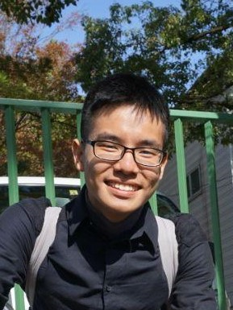
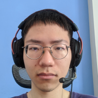
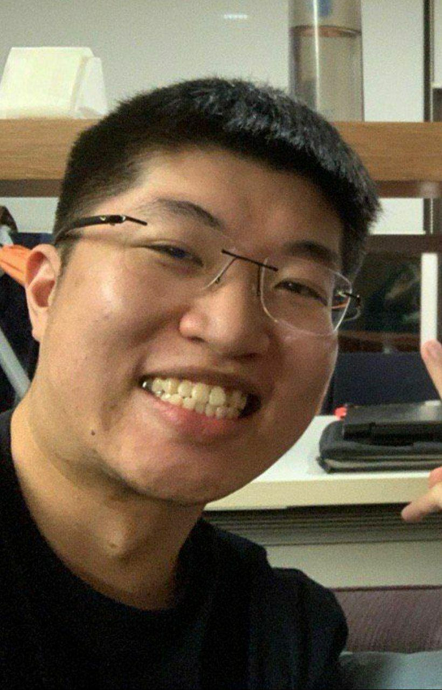
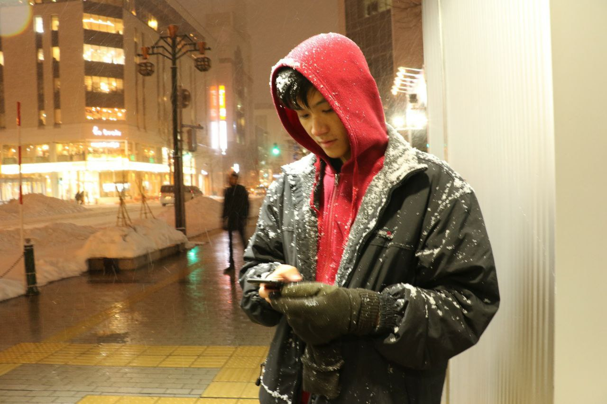

We are a team based in the [School of Computing, National University of Singapore](http://www.comp.nus.edu.sg).

You can reach us at the email `seer[at]u.nus.edu`

## Project team

### Chan Jun Da

[[github](https://github.com/chan-j-d)]
[[portfolio](team/chan-j-d.md)]

* Role: Developer
* Responsibilities: documentation, contact edit and find commands, tag and contact backend management, tag commands, general project requirements

### Hendey Fan

[[github](http://github.com/LinkedInk)]
[[portfolio](team/linkedink.md)]

* Role: Developer
* Responsibilities: mostly events and its integration with contacts

### Illio Suardi

[[github](http://github.com/fyshhh)] [[portfolio](team/fyshhh.md)]

* Role: Developer
* Responsibilities: documentation, UI, general code structure

### Kim Sol

[[github](http://github.com/solkim-83)]
[[portfolio](team/solkim-83.md)]

* Role: Developer
* Responsibilities: Documentation, In charge of Events

### Wu Bangyi

[[github](http://github.com/bangyiwu)]
[[portfolio](team/bangyiwu.md)]

* Role: Developer
* Responsibilities: Documentation, UI, In charge of Contacts
