* Table of Contents
{:toc}

---

## **Introduction**

This document shows program architecture and implementation decisions for the contact-and-event management app, Athena.

##### **Purpose**
The purpose of this document is to provide technical details and explanations for the high-level design of Athena and each subcomponent that Athena uses. 
The intended audience for this document is software engineers maintaining or expanding on Athena, and software testers.

--------------------------------------------------------------------------------------------------------------------

## **Setting up, getting started**

Refer to the guide [_Setting up and getting started_](SettingUp.md).

--------------------------------------------------------------------------------------------------------------------

## **Design**

### Architecture

The ***Architecture Diagram*** given above explains the high-level design of the App. Given below is a quick overview of each component.

:bulb: **Tip:** The `.puml` files used to create diagrams in this document can be found in the [diagrams](https://github.com/AY2021S1-CS2103T-W10-4/tp/tree/master/docs/diagrams/) folder. Refer to the [_PlantUML Tutorial_ at se-edu/guides](https://se-education.org/guides/tutorials/plantUml.html) to learn how to create and edit diagrams.

**`Main`** has two classes called [`Main`](https://github.com/AY2021S1-CS2103T-W10-4/tp/tree/master/src/main/java/seedu/address/Main.java) and [`MainApp`](https://github.com/AY2021S1-CS2103T-W10-4/tp/tree/master/src/main/java/seedu/address/MainApp.java). It is responsible for,
* At app launch: Initializes the components in the correct sequence, and connects them up with each other.
* At shut down: Shuts down the components and invokes cleanup methods where necessary.

[**`Commons`**](#common-classes) represents a collection of classes used by multiple other components.

The rest of the App consists of four components.

* [**`UI`**](#ui-component): The UI of the App.
* [**`Logic`**](#logic-component): The command executor.
* [**`Model`**](#model-component): Holds the data of the App in memory.
* [**`Storage`**](#storage-component): Reads data from, and writes data to, the hard disk.

Each of the four components,

* defines its *API* in an `interface` with the same name as the Component.
* exposes its functionality using a concrete `{Component Name}Manager` class (which implements the corresponding API `interface` mentioned in the previous point.

For example, the `Logic` component (see the class diagram given below) defines its API in the `Logic.java` interface and exposes its functionality using the `LogicManager.java` class which implements the `Logic` interface.

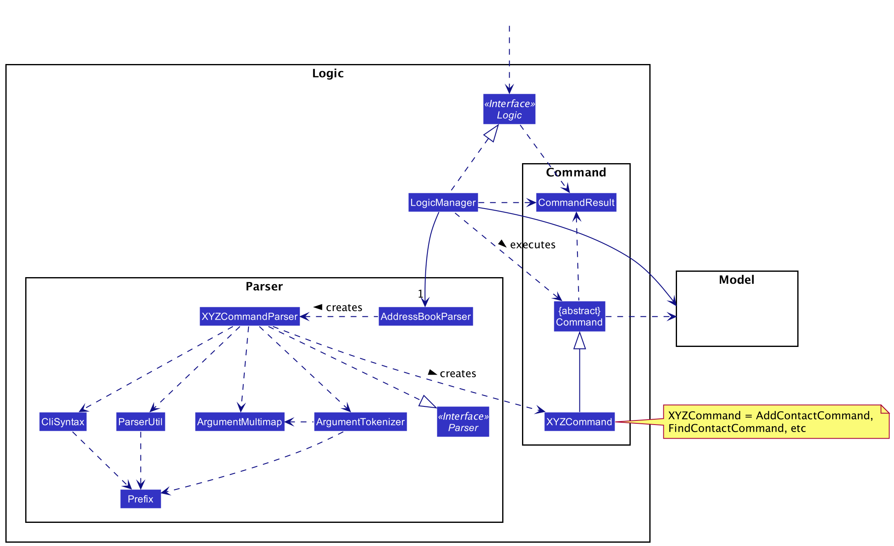

**How the architecture components interact with each other**

The *Sequence Diagram* below shows how the components interact with each other for the scenario where the user issues the command `delete -c 1`.

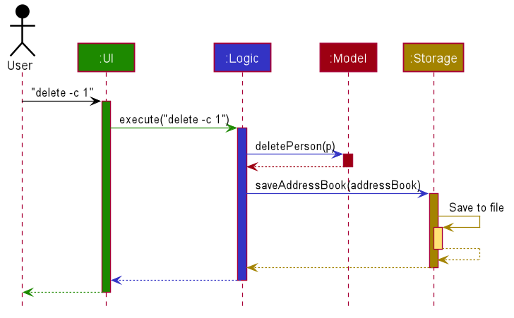

The sections below give more details of each component.

### UI component

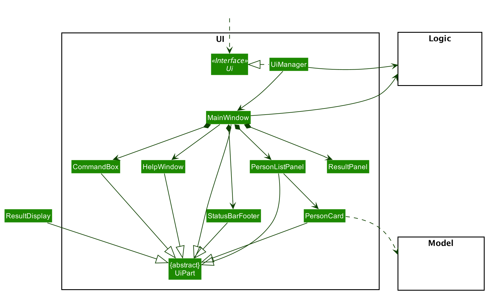

**API** :
[`Ui.java`](https://github.com/AY2021S1-CS2103T-W10-4/tp/tree/master/src/main/java/seedu/address/ui/Ui.java)

The UI consists of a `MainWindow` that is made up of parts e.g.`CommandBox`, `ResultPanel`, `PersonListPanel`, `StatusBarFooter` etc. All these, including the `MainWindow`, inherit from the abstract `UiPart` class.

The `UI` component uses JavaFx UI framework. The layout of these UI parts are defined in matching `.fxml` files that are in the `src/main/resources/view` folder. For example, the layout of the [`MainWindow`](https://github.com/AY2021S1-CS2103T-W10-4/tp/tree/master/src/main/java/seedu/address/ui/MainWindow.java) is specified in [`MainWindow.fxml`](https://github.com/AY2021S1-CS2103T-W10-4/tp/tree/master/src/main/resources/view/MainWindow.fxml)

The `UI` component,

* Executes user commands using the `Logic` component.
* Listens for changes to `Model` data so that the UI can be updated with the modified data.

### Logic component

**API** :
[`Logic.java`](https://github.com/AY2021S1-CS2103T-W10-4/tp/tree/master/src/main/java/seedu/address/logic/Logic.java)

1. `Logic` uses the `Parser` class to parse the user command.
1. This results in a `Command` object which is executed by the `LogicManager`.
1. The command execution can affect the `Model` (e.g. adding a contact).
1. The result of the command execution is encapsulated as a `CommandResult` object which is passed back to the `Ui`.
1. In addition, the `CommandResult` object can also instruct the `Ui` to perform certain actions, such as displaying help to the user.

Given below is the Sequence Diagram for interactions within the `Logic` component for the `execute("delete -c 1")` API call.

:information_source: **Note:** The lifeline for `DeleteContactCommandParser` should end at the destroy marker (X) but due to a limitation of PlantUML, the lifeline reaches the end of diagram.

### Model component

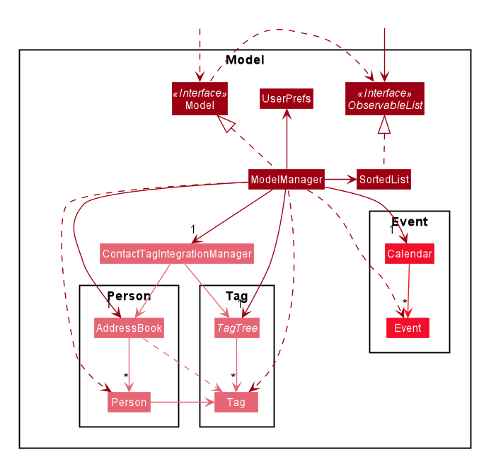

**API** : [`Model.java`](https://github.com/AY2021S1-CS2103T-W10-4/tp/tree/master/src/main/java/seedu/address/model/Model.java)

The `Model` encapsulates all data required for Athena to run. In particular, it stores all contacts (as `person` objects), `tag`s and `event`s.
It is meant to fulfill the Facade pattern as the Facade class by hiding the individual classes that store the individual entities and forcing higher level components like the `Command`s and `Logic` to interact only with `Model`.
It is made up of four major components:

1. `AddressBook` which manages the contacts in the form of `Person` objects.
1. `Calendar` which manages the events in the form of `Event` objects.
1. `TagTree` which manages `tag` to `tag` relations.
1. `RemindersImpl` which manages `reminder` to `event` relations.

Additionally, `Model` also has the following characteristics: 
* stores a `UserPref` object that represents the user’s preferences.
* exposes an unmodifiable `ObservableList<Person>` that can be 'observed' e.g. the UI can be bound to this list so that the UI automatically updates when the data in the list change.
* does not depend on any of the other three high-level components.

### Storage component

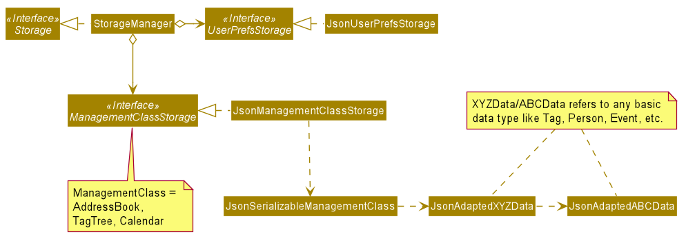

**API** : [`Storage.java`](https://github.com/AY2021S1-CS2103T-W10-4/tp/tree/master/src/main/java/seedu/address/storage/Storage.java)

The `Storage` component,
* can save `UserPref` objects in json format and read it back.
* can save the address book data in json format and read it back.

### Common classes

Classes used by multiple components are in the `seedu.addressbook.commons` package.

--------------------------------------------------------------------------------------------------------------------

## **Implementation**
This section describes some noteworthy details on how certain features are implemented.

### Displaying introduction window

##### General design
An introduction window is displayed by Athena for users unfamiliar with how the application works. This is done by
checking if either `AddressBook.json` or `Calendar.json` exist in the designated save-path. If neither are found, Athena
assumes that the user has not opened the application before, and will display the introduction window. The introduction
comprises a tutorial on basic command use that prompts users to make changes to the default save, and thus will create
a new save file.

The sequence diagram below illustrates the interaction between `UiManager`, `MainWindow`, `LogicManager` and
`IntroCommand` when the application is launched.

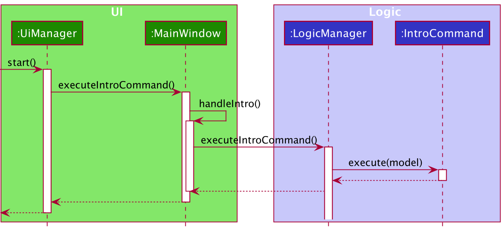

This implementation deviates from the sequence regular commands obey (see [below](#command-implementation))
by implementing `executeIntro()`, whereas regular commands use `execute(String)`. This is to prevent users from being
able to display the introduction window through the invocation of a command.

##### Design choice

As the introduction window should be displayed when the application is opened, any method calls has to be done while
the system is aware that the application is in the phase of being set up. As a result, determining whether the
introduction window should be shown is done when the Ui is being created and filled in.

An important factor to consider when implementing this command is to prevent users from being to invoke it. This means
that, unlike regular commands, no keyword parsed should call the method, and thus it can be entirely absent from
`AddressBookParser`. Since it should not be parseable, regular methods that are used to handle command inputs are
inapplicable, thus necessitating creation of custom methods such as `handleIntro()` and `executeIntroCommand()`.

##### Design improvements

As the presence of save files are used to check if the introduction window should be shown, Athena will falsely flag
users who have no save file as first time users and show the introduction window nonetheless. A solution for this
problem would be to have a file dedicated to storing user preferences. As Athena grows in features and customisability,
it is likely that such a file would be necessary in the future; however, it is currently difficult to justify this
implementation.

### Command implementation

This section details the implementation of Athena's Command system.

##### General design

In Athena, actions done by the system are determined by user inputs. There are 3 components that enable this:

* `AddressBookParser` - manages the parsing of user inputs as Strings,
* `XYZCommand` - contains the logic used in the execution of the Command,
* `XYZCommandParser` - parses any additional inputs that the Command may need; depending on the actual Command, this class may not exist.

**`AddressBookParser`** component:

User input is parsed by `AddressBookParser`'s `parseCommand(String)` method, which first ensures the input conforms to
the correct input pattern. It then splits the input into 3 parts:

1. `commandWord` - describes the *command* that is to be invoked e.g. `add`, `list`, etc.,
2. `commandType` - describes the type of *functionality* that the command targets e.g. `-c` for contacts,
`-e` for events, etc.,
3. `arguments` - describes additional arguments that the command may need; this field may be empty depending on the
commmand.

The `commandWord` and `commandType` fields are both instances of `CommandWord` and `CommandType` enumerations
respectively. These enumerations each contain a `HashMap` that stores Strings of the commands as keys and the actual
enumerations as their values. Based on the enumerations that each input generate, either a `ParseException` is thrown
for an invalid input, or an `XYZCommand` or `XYZCommandParser` object is created, depending on the command.

**`XYZCommand`** component:

All `XYZCommand` classes extend from the `Command` abstract class, which implements the `execute(Model)` method. This
method updates the model with appropriate changes and returns a `CommandResult` object with a message to display to be
displayed. The changes are handled by the façade class `Model`: changes to data are reflected in `PersonListPanel` and
`EventListPanel`, whereas the message is displayed on the `ResultPanel`.

**`XYZCommandParser`** component:

Certain commands may necessitate a way to parse additional inputs - this is done through the implementation of an
`XYZCommandParser` class that implements the `Parser` interface, which implements the `parse(String)` method. This
method uses `ArgumentTokenizer.tokenize(String)` to map each prefix to the corresponding input(s), stored in an
`ArgumentMultimap` object. For instance, an input of `n/John t/tag1 t/tag2` will generate the following
key-value pairs in `ArgumentMultimap`:

`n/` -> `John` 
`t/` -> `tag1`, `tag2`

Any invalid inputs will throw a `ParseException`. If the necessary inputs exist and are valid, then the corresponding
`XYZCommand` object will be created.

##### Design choice

As Athena supports multiple functionalities and sub-functionalities, there are many similar commands that have
overlapping command names. Initially, these command inputs followed closely to AB-3's - adding a contact was done with
`add`. As the event feature was added, the commands were appended with the appropriate type, so adding an event was
done with `addEvent`. This led to inconsistency in the command naming structure, proving to be unsustainable should
more methods and functionalities are added.

This command implementation structure thus makes it easier for users to invoke commands (since there is no need to input
an uppercase character) and developers to add more commands while keeping the `AddressBookParser` class relatively clean
and understandable.

##### Design improvements

Ideally, the `AddressBookParser` should not know whether an `XYZCommand` or an `XYZCommandParser` object is created. A
possible improvement would be to implement an intermediary static method in the `XYZCommandParser` class that creates
an `XYZCommand` or `XYZCommandParser` object depending on the type of the command.

### Sort contacts feature
The sort contacts feature is facilitated by `Addressbook` that stores reminder entries and their details in Athena. 

Additionally, it executes the sorting operation based on 3 sorting patterns:
* `sort -c 1` - Sorts the contacts based on the name of the contacts in alphabetical order.
* `sort -c 2` - Sorts the contacts based on the address of the contacts in alphabetical order. 
* `sort -c 3` - Sorts the contacts based on the email of the contacts in alphabetical order. 

SortContactCommand#execute() : Does validity check of input and then sorts the contacts according to user input (index))

The sorting function is designed with the aim of temporary modification of the contact-related entries in `RemindersImpl`.

##### How sort contact executes
  
The following activity diagram summarizes what happens when a user executes `sort -e` command:
  
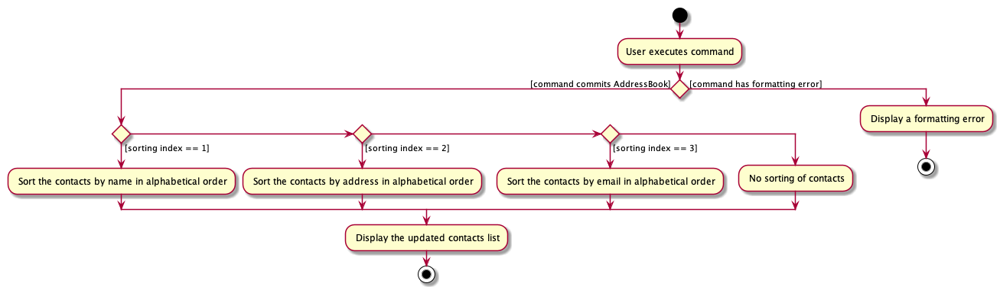

### Contact and tag management
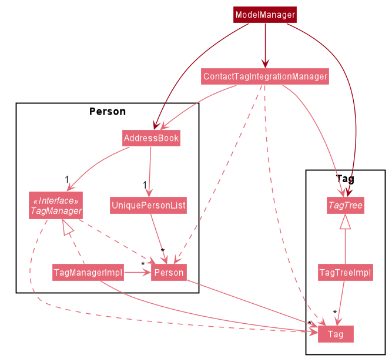

##### General design
**Contact (`Person`)** component: 

In Athena, contacts are represented by `Person` objects. `Person` objects have several properties such as email, address, etc. A `Person` can also be tagged with multiple `Tag`s.
- `AddressBook` handles all direct matters concerning `Person` objects. It has a `TagManager` and `UniquePersonList`.  
- `UniquePersonList` keeps track of all `Person` objects. It uses `Person` class' `isSamePerson(Person)` method to ensure that there are no duplicate contacts in Athena.
- `TagManager` keeps track of which contacts contain which tags. It uses a hash map, mapping each `Tag` to the set of `Person`s that contain the `Tag`. 

All manipulation of `Person` objects have to be done through `AddressBook`. `AddressBook` provides methods that can be used by higher-level components to query or edit details regarding contacts. 

**`Tag`** component:

`Tag`s are represented by a single alphanumeric string with no spaces. There is support for child-tagging. This allows directional relations to be established between `Tag`s. Certain commands will group a `Tag` together with its sub-tags to perform an action.
- `TagTree` handles tag-to-tag relations. 
- `TagTreeImpl` extends from the abstract class `TagTree`. It uses a tree data structure to store directional tag-to-tag relations. 
The implementation of the tree is done with a hash map, mapping each `Tag` to its set of child-tags. For convenience, the reverse mapping (i.e. map from each `Tag` to its set of parent-tags) is also provided. 

Any new links established between tags have to go through the `TagTree`. `TagTree` provides methods to query or edit tag-to-tag relationships.

**`Integration`** component:

The `ContactTagIntegrationManager` class provides a few predefined methods for functions that will affect both `Person`s and `Tag`s at the same time. 

This class is meant to address the difficulty in preserving consistency within the system.
For example, two different `deleteTag` methods are implemented in both `TagTree` and `ContactTagIntegrationManager`.
However, the method in `TagTree` only deletes the specific `Tag` in `TagTree` while `AddressBook` would still maintain a reference to the same `Tag`.
The method in `ContactTagIntegrationManager` uses `TagTree`'s `deleteTag(Tag)` method, then removes the `Tag` from all `Person` objects that has the `Tag`.
The sequence diagram below illustrates the interactions between the `ContactTagIntegrationManager`, `AddressBook` and `TagTree` when `execute("delete -t t/cs2103")`.

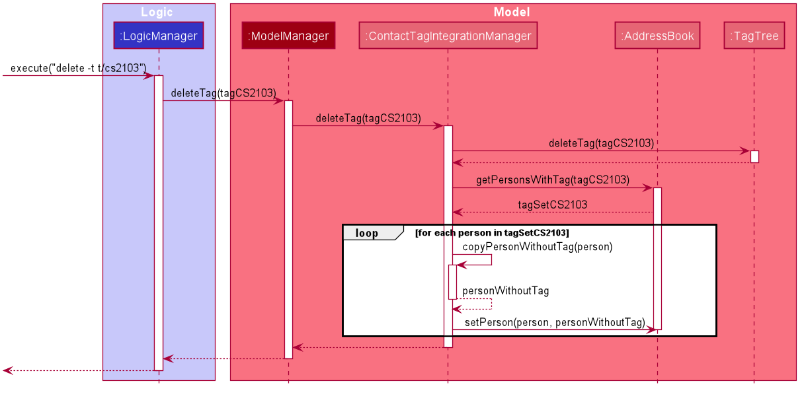

As such, the `ContactTagIntegrationManager`'s job is to preserve consistency in the `Model` when a change is made in either `AddressBook` or `TagTree` that will indirectly affect the other component.
Thus, higher-level modules should use the methods in `ContactTagIntegrationManager` if available.

##### Design choice
In the context of tag management, this design choice is aimed at properly encapsulating two separate functionalities.
1. `AddressBook` - uses `TagManager` to track which `Person` objects falls under which `Tag`s. 
    - `TagManager` is necessary to avoid cyclic dependency between `Person` and `Tag`. 
    - `TagManager` is embedded in `AddressBook`, so whenever there is a change to the list of `Person`s, the tag-to-person map can be updated immediately.
2. `TagTree` tracks the tag-to-tag relationships only. In particular, it keeps track of which set of `Tag`s are child-tags of which `Tag`. 

Using these two mutable constructs, it allows for accurate realtime queries by higher-level components even though the internal mapping changes frequently between commands.
To ensure that the right commands are called at the right time, `Model` only implements a limited set of methods that can change the internal mapping.
To support a greater variety of `Command`s, ensure that the correct methods from either `AddressBook`, `TagTree` or `ContactTagIntegrationManager` are chosen. 
A rule of thumb is to search for the method in `ContactTagIntegrationManager` first before looking for a similar method in the other two classes. 

To implement a new functionality that is not currently supported in any of the three classes, consider whether the method should affect both `AddressBook` _and_ `TagTree`.
If it has the potential to affect both, the method should be implemented in `ContactTagIntegrationManager`. Otherwise, implement them in the relevant class.
 
To view the full list of methods and documentation for the three major classes, you can view them at [`AddressBook`](https://github.com/AY2021S1-CS2103T-W10-4/tp/blob/master/src/main/java/seedu/address/model/AddressBook.java), 
[`TagTree`](https://github.com/AY2021S1-CS2103T-W10-4/tp/blob/master/src/main/java/seedu/address/model/tag/TagTree.java) and [`ContactTagIntegrationManager`](https://github.com/AY2021S1-CS2103T-W10-4/tp/blob/master/src/main/java/seedu/address/model/ContactTagIntegrationManager.java).

##### Design improvement
A possible way to improve the current design is to remove dependency from `ModelManager` to `TagTree`, `AddressBook` and `ContactTagIntegrationManager` by creating another Facade class containing these three classes.
As such, only the relevant methods required for specific `Command`s to work will be exposed to `Model`. For example, right now, both `ContactTagIntegrationManager`'s `deleteTag(Tag)` method and `TagTree`'s `deleteTag(Tag)` method are exposed to `ModelManager` when only one of them is actually used.
This makes it easier for others working at a similar level of abstraction to avoid using the wrong methods.  

##### Testing
Testing of `ContactTagIntegrationManager` methods are inherently difficult as unit testing is in this context achieves very little. To help with integration testing of methods in `ContactTagIntegrationManager`, a test `contactTagIntegrationManager` object can be created from `ContactTagIntegrationManagerTest.buildTestContactTagIntegrationManager()`.    
The test object structure is presented in the diagram below.

This provides support for testing of new methods, making it easy to write new test cases and check the expected behaviour. It is also easier for others to understand what the test cases are accomplishing.

##### [Proposed] Visualisation
The current implementation of parent-child tagging is difficult to visualise. Currently, there exists only the `list -t` method that states a brief summary, and `view -t` that lists out full details for singular tag.
This proposed feature is a new command `viewtree -t` that displays a pop-up visual of a tag tree display together with a summary of contacts tagged under each tag. 

_Required modules_:
1. Graphical node: Given a tag and a set of contacts, the node will contain the tag name and a summary of contacts.
1. Graphical edge: An arrow directing from parent-tag to child-tag.
1. Graph: A class that holds all graphical nodes and graphical edges
1. Graph layout algorithm: Given a graph, this algorithm decides how to layout the various nodes in the graph

A partial implementation can be found [here](https://github.com/chan-j-d/tp/tree/add-gui-tag-support). The image used in [testing](#testing) was created by this partial implementation.
This implementation supports the `viewtree -t` command that shows the current tag tree for all contacts in Athena.

_Way forward_:

The current implementation always displays every single parent-child tag relation. As such, it can get convoluted really quickly. We can implement a way to distill only the requested information such as displaying the nodes and edges of a tag and all its child-tags. 
Additionally, there is a need to scope the tag tree viewing feature towards the target user, with a focus towards keyboard commands.
As such, there are two general alternatives:
1. Add a textbox in the graph display that allows input commands. The supported commands could include
    1. `{tag name}`: Displays only relevant information for `{tag name}` and all its sub-tags.
    1. `-all`: Shows all parent-child tag relations.
    1. `-exit`: Exits the graphical display.
2. Replace the current `view -t` command. Instead, the `view -t` command will support only one tag argument and display a visual representation of the tag and all its sub-tags.
Using the modules listed above, a possible activity diagram for this implementation is shown below.

_Issues_:

As of now, the ability for commands to affect GUI components in Athena is limited. Thus, properly implementing this would likely require additional backend support for allowing commands to produce GUI effects.

##### Additional notes:
_Definitions_:
- For a `Tag` to _exist_ in Athena, the `Tag` must have either at least one `Person` with the `Tag` **or** at least one child-tag.
- A _child-tag_ of a tag signifies a directional relation from a tag to its _child-tag_. It allows for some commands that affect a tag to also affect its _child-tag_. The reverse cannot be done. The other tag in the relationship is the _parent-tag_.
- _Parent-tag_: see _child-tag_.
- A _sub-tag_ of a tag signifies a multi-step directional relation from a tag to the _sub-tag_ (i.e. a sub-tag of a tag is a child-tag, or a child-tag of a child-tag, etc.).
A child-tag of a tag is also a _sub-tag_.
 
_Delete single tag behavior_:  
Suppose we delete a single `Tag`, the parent-tags of `Tag` will be reconnected to the child-tags of `Tag` as illustrated by the image below.
 
  
We have intentionally chosen this design in order to preserve the effectiveness of top-down queries of all sub-tags.

### Event and attendees management

##### General design
**`Event`** component:

In Athena, events are represented by `Event` objects. `Event` objects have a description and a time. An `Event` may or may not have attendees.

- `Calendar` handles all direct matters concerning `Event` objects. It has a `UniqueEventList`.
- `UniqueEventList` keeps track of all `Event` objects. It uses Event class’ `isSameEvent(Event)` method to ensure that there are no duplicate events in Athena.
- All manipulation of `Event` objects have to be done through Calendar. Calendar provides simple methods that can be used by higher-level components such as the `ModelManager` class.

**Attendees (`FauxPerson`)** component:

- `Event` objects can have attendees in the form of a set of `FauxPerson`.
- `FauxPersons` are created from `Person` objects taken from the `AddressBook`.

##### How events gain/lose attendees

**During add event:**

* No change if there are no attendees to add.
* If user indicates to add attendees:
  * The `Person`s representing the contacts are retrieved using the indices provided by user input.
  * A `FauxPerson` is created for each of them
  * `FauxPerson`s are grouped into a set and set as the `Event`'s attendees.

This diagram shows the overview of the operation:

**During edit event:**

* No change if there are no attendees to add or remove.
* If user indicates to remove attendees:
  * Removal of attendees is done first before addition of attendees.
  * Based on the indices provided, the `FauxPerson`s at the given indices is removed.
* If user indicates to add attendees:
  * The `Person`s representing the contacts are retrieved using the indices provided by user input.
  * A `FauxPerson` is created for each of them
  * `FauxPerson`s are grouped into a set and set as the `Event`'s attendees.
  
This diagram shows the overview of the operation:

### Sort events feature
The sort events feature is facilitated by `Calendar` that stores event entries and their details in Athena. 

Additionally, it executes the sorting operation based on 2 sorting patterns:
* `sort -e 1` - Sorts the events based on the description of the events in alphabetical order.
* `sort -e 2` - Sorts the events based on the time of the events in chronological order. 

SortEventCommand#execute() : Does validity check of input and then sorts the event according to user input (index))

The sorting function is designed with the aim of temporary modification of the event-related entries in the `Calendar`. 
This is to create a default sorting pattern (based on the description of the events in alphabetical order) for easier reference. 

The following sequence diagram shows how the `sort -e` operation works:

#### Design consideration:

##### Aspect: How sort executes

* **Alternative 1 (current choice):** Temporarily sorts the event entries.
  * Pros: Will use less memory.
  * Cons: May cause inconvenience to the users.

* **Alternative 2:** Automatically sorts the event entries based on one sorting order as they are being added/ deleted/ edited.
  * Pros: Will be more convenient for the users. (As they do not need to manually sort) 
  * Cons: May restrict the usage and benefit of the app. (As only one sorting pattern is available)
  
The following activity diagram summarizes what happens when a user executes `sort -e` command:
  

### List events feature

#### Display feature
The display feature for the events is facilitated by `Calendar` that stores event entries and their details in Athena,
and has a specific command of `list -e` where the command makes use of `ListEventCommand`. 

ListEventCommand#execute() : Does validity check of current list and displayed all event-related entries.

##### Aspect: How list executes
The feature is designed to provide the users with the entire list of event-related entries, especially after 
when user executes certain commands that display partial list of event list (e.g. SearchEvent Command).

### Reminders Management

##### General design
**`Reminders`** component: 

In Athena, reminders are represented by `Reminder` objects. 
Reminder objects have two fields, an Event *eventForReminder* and a Time *dateForReminder*, which indicates when the reminder will be activated.
- `RemindersImpl` handles all direct matters concerning `Reminder` objects. It has a `UniqueRemindersList`. 
- `UniqueReminderList` keeps track of all `Reminder` objects. It uses `Reminder` class' `isSameReminder(Reminder)` method to ensure that there are no duplicate reminders in Athena.

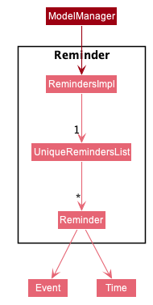

All manipulation of `Reminder` objects have to be done through `RemindersImpl`. `RemindersImpl` provides simple methods that can be used by higher-level components such as 
- `boolean hasReminder(Reminder)`
- `void addReminder(Reminder)`
- `void deletePerson(Reminder)`
- and more

When reminders are active (the current date is after or equals to the *dateForReminder* of the reminder), a pop up window
be displayed whenever Athena is opened. The pop up window will alert the user of this reminder. 

##### Design choice
Reminder implements a very similar storage and manipulating system to events and contacts. This is to maintain homogeneity
and ensure that developers can add-on or edit its features easily as long as they understand the other systems.
The pop up window is designed as such so that reminders are less passive and can actively remind the users without them pulling 
up the list of reminders themselves.
 
##### Way Forward: Design improvement
More reminder functions should be implemented for user convenience. As the RemindersImpl and other components
of reminders have already been set up. Developers aiming to add more reminder functions should work on these relevant classes.

For instance, if the developer wishes to add an `EditReminderCommand`, they should make use of the setReminder function that
already exists in the ModelManager and the RemindersImpl classes. If the pre-existing helper functions do not exist, do create
them within those classes as well so as to follow the encapsulation principle. 

##### Add Reminder Feature
RemindEventCommand#execute() : Creates the reminder and adds it to the uniqueRemindersList in RemindersImpl. It also
handles validation of the reminder before it's created. Making sure there is no duplicate reminder and the reminder is 
not set for a date that has already passed. 

When creating a reminder through int *daysInAdvance*, the Reminder constructor calculates the *dateForReminder* by subtracting
*daysInAdvance* from the *eventForReminder*'s scheduled date.

The below sequence diagram shows how Athena handles the construction and addition of a reminder.

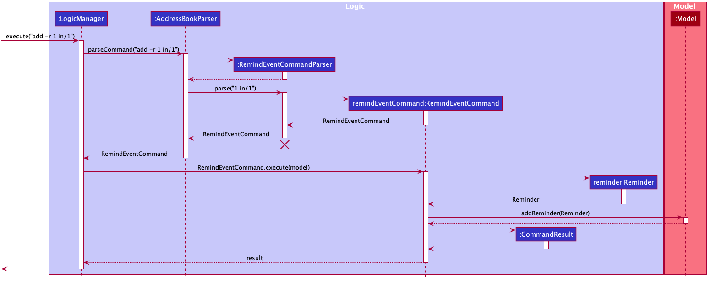

--------------------------------------------------------------------------------------------------------------------

## **Documentation, logging, testing, configuration, dev-ops**

* [Documentation guide](Documentation.md)
* [Testing guide](Testing.md)
* [Logging guide](Logging.md)
* [Configuration guide](Configuration.md)
* [DevOps guide](DevOps.md)

--------------------------------------------------------------------------------------------------------------------

## **Appendix: Requirements**

### Product scope

**Target user profile**:

* has a need to manage a significant number of contacts and events
* requires seamless integration between contact and event tracking (vastly differing participants for different events, for instance)
* prefer desktop apps over other types
* can type fast
* prefers typing to mouse interactions
* is reasonably comfortable using CLI apps

**Value proposition**: manage contacts and events faster than a typical mouse/GUI driven app

### User stories

Priorities: High (must have) - `* * *`, Medium (nice to have) - `* *`, Low (unlikely to have) - `*`

| Priority | As a …​                                  | I want to …​                       | So that I can…​                                                                                        |
| -------- | ------------------------------------------- | ------------------------------------- | --------------------------------------------------------------------------------------------------------- |
| `* * *`  | new user                                    | see usage instructions                | understand how to get started by adding new contacts, removing sample ones and learning advanced commands |
| `* * *`  | user                                        | add a new contact                     | keep track of my contacts                                                                                 |
| `* * *`  | user                                        | delete a contact                      | remove contacts that I no longer need, keeping my contact storage neat and uncluttered                    |
| `* * *`  | user                                        | delete all contacts of a specific tag | remove contacts that I no longer need, keeping my contact storage neat and uncluttered                    |
| `* * *`  | user                                        | view my contacts in an ordered manner | view the details of my contacts                                                                           |
| `* * *`  | user                                        | add a new event                       | keep track of my events                                                                                   |
| `* * *`  | user                                        | delete an event                       | remove events that I no longer need, keeping my event storage neat and uncluttered                        |
| `* * *`  | user                                        | view my events in an ordered manner   | view the details of my events                                                                             |
| `* *`    | user                                        | search for a contact                  | locate details of contacts without having to go through the entire list                                   |
| `* *`    | user                                        | edit a contact's details              | change outdated information without having to delete and re-add contacts                                  |
| `* *`    | user with many contacts in the address book | sort contacts by contact details      | so that I can view my contacts in a more consistent manner and find the contacts I want quickly           |
| `* *`    | user                                        | search for an event                   | locate details of events without having to go through the entire list                                     |
| `* *`    | user                                        | edit an event's details               | change outdated information without having to delete and re-add events                                    |
| `* *`    | user with many events in the calendar       | sort events by event details          | so that I can view my events in a more consistent manner and find the events I want quickly               |
| `* *`    | user with important events                  | set reminders for events              | so that I can get reminder alerts for my important events              |
| `* *`    | experienced user                            | assign tags to a super-tag            | so that I can manage my tags in a more orderly fashion |

### Use cases

(For all use cases below, the **System** is the `Athena` and the **Actor** is the `user`, unless specified otherwise)

#### **Use case: View introduction**

1.  User opens Athena for the first time.

1.  Athena displays an introduction message, with a guide on how to use basic commands.

    Use case ends.

#### **Use case: Add a contact**

**MSS**

1.  User requests to add a contact.

    Use case ends.

**Extensions**

* 1a. User input missing one or multiple fields.

    * 1a1. Athena shows an error message.

    Use case ends.

#### **Use case: Delete a contact**

**MSS**

1.  User requests to list contacts.

1.  Athena shows a list of contacts.

1.  User requests to delete a specific contact in the list.

1.  Athena deletes the contact.

    Use case ends.

**Extensions**

* 2a. The list is empty.

  Use case ends.

* 3a. The given index is invalid.

    * 3a1. Athena shows an error message.

      Use case resumes at step 2.
      
#### **Use case: Delete contacts by tag**

**MSS**

1.  User requests to delete contacts tagged under a specific tag.

1.  User specifies a tag.

1.  Athena deletes all contacts under the specified tag.

    Use case ends.

**Extensions**

* 2a. The tag does not exist.

    * 3a1. Athena shows an error message.

      Use case resumes at step 2.

#### **Use case: Sort through contacts**

**MSS**

1.  User requests to list contacts.

1.  Athena shows a list of contacts in default order.

1.  User requests to sort the contacts in the list.

1.  Athena displays the contacts in the requested order.

    Use case ends.

**Extensions**

* 2a. The list is empty.

    Use case ends.

* 3a. The given index is invalid.

    * 3a1. Athena shows an error message.

      Use case resumes at step 2.

#### **Use case: Edit contact information**

Preconditions: The contact the user wishes to edit is displayed on the UI.

**MSS**

1.  User uses the edit command to inform the system of which fields of the contact they wish to change.

1.  Athena updates the contact information.

1.  Athena sends an acknowledgement message to the user to notify of the edits made.

    Use case ends.

**Extensions**

* 1a. Tag to be removed does not exist.

    * 1a1. Athena notifies the user of the error.
    
    * 1a2. Athena aborts the command without making changes.

      Use case ends.

#### **Use case: Search for contacts**

**MSS**

1. User uses the find command and informs the systems of keywords and additional fields the contact has to match.

1. Athena displays a list of contacts that matches the keywords and contains the additional fields.

    Use case ends.

**Extensions**

* 2a. The list is empty.

    * 2a1. Athena informs the user that their search did not come up with any valid matches.

       Use case ends.

#### **Use case: Add an event**

**MSS**

1.  User requests to add an event

    Use case ends.

**Extensions**

* 1a. The description and/or date time is missing.

    * 1a1. Athena shows an error message.

      Use case ends.

* 1b. The date time format is not accepted.

    * 1b1. Athena shows an error message.
       
      Use case ends.
      
* 1c. There is a duplicate event.

    * 1c1. Athena shows an error message.

      Use case ends.
      
* 1d. There is an event that is occurring at the same time.

    * 1d1. Athena shows an error message.

      Use case ends.

* 1e. The person(s) to be added is/are not found.

    * 1e1. Athena shows an error message.

      Use case ends.
         
#### **Use case: Delete an event**

**MSS**

1.  User requests to view events.

1.  Athena shows a list of events.

1.  User requests to delete a specific event in the list.

1.  Athena deletes the event.

    Use case ends.

**Extensions**

* 2a. The list is empty.

    Use case ends.

* 3a. The given index is invalid.

    * 3a1. Athena shows an error message.

      Use case resumes at step 2.
      
#### **Use case: Edit an event**

**MSS**

1.  User requests to view events.

1.  Athena shows a list of events.

1.  User requests to edit a specific event in the list.

1.  Athena edits the event.

    Use case ends.

**Extensions**

* 2a. The list is empty.

    Use case ends.

* 3a. The given index is invalid.

    * 3a1. Athena shows an error message.

      Use case resumes at step 2.

* 3b. The date time format is not accepted.

    * 3b1. Athena shows an error message.
       
      Use case resumes at step 2.
      
* 3c. There is a duplicate event.

    * 3c1. Athena shows an error message.

      Use case resumes at step 2.
      
* 3d. There is an event that is occurring at the same time.

    * 3d1. Athena shows an error message.

      Use case resumes at step 2.
      
* 3e. The person(s) to be added or removed is/are not found.

    * 3e1. Athena shows an error message.

      Use case resumes at step 2.

#### **Use case: Search for events**

**MSS**

1.  User requests to search for a particular event.

1.  Athena shows a list of events that match the criteria (e.g. contain a certain keyword).

    Use case ends.

**Extensions**

* 1a. The given keyword is invalid.

    * 1a1. Athena shows an error message.

      Use case ends.

* 2a. The list is empty.

    Use case ends.
      
#### **Use case: Sort through events**

**MSS**

1.  User requests to list events.

1.  Athena shows a list of events in default order.

1.  User requests to sort the events in the list.

1.  Athena displays the events in the requested order.

    Use case ends.

**Extensions**

* 2a. The list is empty.

    Use case ends.

* 3a. The given index is invalid.

  * 3a1. Athena shows an error message.

    Use case resumes at step 2.
    
#### **Use case: View details of an event**

**MSS**

1.  User requests to view events.

1.  Athena shows a list of events.

1.  User requests to view details of an event.

1.  Athena displays the event details in the result panel.

    Use case ends.

**Extensions**

* 2a. The list is empty.

    Use case ends.

* 3a. The given index is invalid.

    * 3a1. Athena shows an error message.

      Use case resumes at step 2.
      
#### **Use case: List all saved events**

**MSS**

1.  User requests a list of all events saved.

1.  Athena shows a list of events. 

    Use case ends.

**Extensions**

* 2a. The list is empty.

    Use case ends.
    
#### **Use case: Add a tag**

**MSS**

1. User requests to add a reminder.

1. User specifies contacts to be added to this tag.

1. User specifies other tags to be added as child-tags.

1. Athena adds the new tag and its relations to specified contacts and child-tags.

    Use case ends.

**Extensions**
* 1a. The tag already exists in Athena.

    * 1a1. Athena shows an error message.
    
      Use case ends.
* 2a. Contact specified is invalid.

    * 2a1. Athena shows an error message.
    
      Use case ends.
* 3a. Child-tag specified does not exist.

    * 3a1. Athena shows an error message.
    
      Use case ends.

  
#### **Use case: List all tags**

**MSS**

1. User requests to view all tags in Athena.

1. Athena shows a list of tags.

    Use case ends.
    

#### **Use case: Add a reminder**

**MSS**

1. User requests to add a reminder.

1. User specifies which event this reminder is for.

1. User specifies when he wants to activate this reminder.

1. Athena adds the new reminder.

    Use case ends.

**Extensions**
* 2a. There is already a reminder for the event.

    * 2a1. Athena shows an error message.
    
      Use case ends.
* 2a. The target event does not exist. Event index entered is negative or greater than the size of the events list.

    * 2a1. Athena shows an error message.
    
      Use case ends.
* 3a. The reminder is set to activate before the current date.

    * 3a1. Athena shows an error message.
    
      Use case ends.
      
#### **Use case: Delete a reminder**

**MSS**

1. User requests to delete a reminder.

1. User specifies which reminder to delete.

1. Athena deletes the reminder.

    Use case ends.

**Extensions**
* 2a. The reminder does not exist. Reminder index entered is negative or greater than the size of the reminders list.

    * 2a1. Athena shows an error message.
    
      Use case ends.

#### **Use case: List all reminders**

**MSS**

1. User requests to view all reminders in Athena.

1. Athena shows a list of reminders.

    Use case ends.   
 

#### **Use case: Find a tag**

**MSS**

1. User requests to find a tag.

1. User specifies keyword to use in the search.

1. User specifies whether any tag filters should be used.

1. Athena displays all tags that match the keyword and filter.

   Use case ends.
   
**Extensions**

* 3a. Tag filter input is invalid.

    * 3a1. Athena displays an error message.
    
    Use case resumes at step 3.

* 4a. List is empty.

    * 4a1. Athena displays a message stating there are no matches.
    
    Use case ends.

### Non-Functional Requirements

1.  Should work on any _mainstream OS_ as long as it has Java `11` or above installed.
1.  Should be able to hold up to 1000 contacts and events without a noticeable sluggishness in performance for typical usage.
1.  Should be sufficiently intuitive for new or inexperienced users to understand and navigate.
1.  A user with above average typing speed for regular English text (i.e. not code, not system admin commands) should be able to accomplish most of the tasks faster using commands than using the mouse.
1.  Should not require an internet connection (bar downloading the app).

### Glossary

* **Contact**: A contact to be tracked by Athena; comprises a name, phone number, email and address, as well as an arbitrary quantity of tags
* **Event**: An event to be tracked by Athena; comprises a name and a date and time, as well as an arbitrary quantity of tags
* **Mainstream OS**: Windows, Linux, Unix, OS-X 

--------------------------------------------------------------------------------------------------------------------

## **Appendix: Instructions for manual testing**

Given below are instructions to test the app manually.

:information_source: **Note:** These instructions only provide a starting point for testers to work on;
testers are expected to do more *exploratory* testing.

### Launch and shutdown

1. Initial launch

   1. Download the jar file and copy into an empty folder.

   1. Double-click the jar file Expected: Shows the GUI with a set of sample contacts. The window size may not be optimum.

1. Saving window preferences

   1. Resize the window to an optimum size. Move the window to a different location. Close the window.

   1. Re-launch the app by double-clicking the jar file. 
       Expected: The most recent window size and location is retained.
       
### Editing a contact

1. Editing a contact while all contacts are being shown

    1. Test case: `edit -c 1 n/test name p/912345 t/edittest`  
       Expected: Contact at index `1` in the list has its name changed to `test name`, phone number to `912345` and the tag `edittest` added.
       
    1. Test case: `edit -c 1 t/cs2103 t/cs2101 rt/edittest` (done after step 1)  
       Expected: Contact at index `1` has tag `edittest` removed and tags `cs2103` and `cs2101` added.
       
    1. Test case: `edit -c 1 rt/*`  
       Expected: Contact at index `1` has all its tags removed.
       
    1. Test case: `edit -c 1 n/$%^&a`  
       Expected: Error message shown as the name input fails the field constraints.
       
### Finding a contact

1. Finding a contact

    1. Test case: `find -c n/alex betsy`
       Expected: For default contact list, shows `Alex Yeoh` and `Betsy Crower` (and possibly other contacts containing either `alex` or `betsy`).
       
    1. Test case: `find -c e/@example`
       Expected: Lists all contacts with `@example` in their emails.
       
    1. Test case: `find -c t/friends`
       Expected: Lists all contacts with the tag `cs2030`.
       
### Deleting a contact

1. Deleting a contact while all contacts are being shown

   1. Prerequisites: List all contacts using the `list -c` command. Multiple contacts in the list.

   1. Test case: `delete -c 1` 
      Expected: First contact is deleted from the list. Details of the deleted contact shown in the status message. Timestamp in the status bar is updated.
      
   1. Test case: `delete -c 1,2` 
      Expected: First 2 contacts are deleted from the list. Details of the contacts events shown in the status message.

   1. Test case: `delete -c 0` 
      Expected: No contact is deleted. Error details shown in the status message. Status bar remains the same.

   1. Other incorrect delete commands to try: `delete -c`, `delete -c x`, `...` (where x is larger than the list size) 
      Expected: Similar to previous.
      
### Editing an event

1. Editing an event while all events are being shown

    1. Test case: `edit -e 1 d/test at/10-10-21 14/00`  
       Expected: Event at index `1` in the list has its description changed to `test` and time changed to `Sun 10th Oct 2021 2:00pm`.
       
    1. Test case: `edit -e 1 ap/*` (assuming there are contacts displayed, and done after step 1)  
       Expected: All persons show in the contact list is added to event at index `1` as attendees.
       
    1. Test case: `edit -e 1 rp/*` (done after step 1 and 2)  
       Expected: Event at index `1` has all attendees removed.
       
    1. Test case: `edit -e 1 d/`  
       Expected: Error message shown as the description input is empty.
       
### Finding an event

1. Finding an event

    1. Test case: `find -e meeting`
       Expected: For default event list, shows `CS2103 Meeting` (and possibly other contacts containing `meeting`).
       
    1. Test case: `find -e Run`
       Expected: For default event list, shows `Night run` (and possibly other contacts containing `run`).
       
### Deleting an event

1. Deleting a contact while all events are being shown

   1. Prerequisites: List all events using the `list -e` command. Multiple events in the list.

   1. Test case: `delete -e 1` 
      Expected: First event is deleted from the list. Details of the deleted event shown in the status message.
      
   1. Test case: `delete -e 1,2` 
      Expected: First 2 events are deleted from the list. Details of the deleted events shown in the status message.

   1. Test case: `delete -e 0` 
      Expected: No contact is deleted. Error details shown in the status message. Status bar remains the same.

   1. Other incorrect delete commands to try: `delete -e`, `delete -e x`, `...` (where x is larger than the list size) 
      Expected: Similar to previous.

### Adding a tag

1. Adding a new tag to various contacts

   1. Prerequisites: List all contacts using the `list -c` command. Multiple contacts in the list.
   
   1. Test case: `add -t n/testtag1 i/1 i/2` 
      Expected: Contacts at indices `1` and `2` now have the tag `testtag1`.
      
   1. Test case: `add -t n/testtag2 i/3 t/testtag1` 
      Expected: Contact at index `3` has the tag `testtag2`. When `list -t` command is used, `testtag2` will be labelled as a `supertag`.
       
   1. Test case: `add -t n/testtag1 i/4` (has to be done after step 2)   
      Expected: Error message shown, saying that `testtag1` already exists.
      
### Deleting a tag

1. Deleting a tag

   1. Prerequisites: List all contacts using the `list -c` command. Multiple contacts in the list.
   
   1. Perform steps 2 & 3 of [Adding a tag](#adding-a-tag) if it has not been done. Then perform `add -t n/testtag3 t/testtag2`.
   
   1. Test case: `delete -t t/testtag2`  
      Expected: Contact at index 3 no longer has the tag `testtag2`. When `list -t` is used, `testtag2` can no longer be found. When using `view -t t/testtag3`, `testtag1` is listed as a child-tag of `testtag3`.
       
   1. Test case: `delete -t t/testtag3 r/1`  
      Expected: Contacts at indices 1 and 2 no longer have the tag `testtag1`. `list -t` now has neither `testtag1` nor `testtag3`.
   
### Editing a tag

1. Editing a tag

   1. Prerequisites: List all contacts using the `list -c` command. Multiple contacts in the list.
   
   1. Perform steps 2 & 3 of [Adding a tag](#adding-a-tag) if it has not been done. 
   
   1. Test case: `edit -t n/testtag2 i/2 ri/3`  
      Expected: Contact at index 3 no longer has the tag `testtag2`. Contact at index 1 has the tag `testtag1`.
      
   1. Test case: `edit -t n/testtag2 rt/testtag1`  
      Expected: When `view -t t/testtag2`, `testtag1` is no longer listed as a child-tag of `testtag2`.
      
   1. Test case: `edit -t n/testtag2 t/testtag1` followed by `edit -t n/testtag1 t/testtag2`
      Expected: Error message shown, indicating an attempt in making a cyclic relationship.
      
### Adding a reminder

1. Adding a new reminder to various events

   1. Prerequisites: Create an event at index 1 that is scheduled to happen one day from now.
   
   1. Test case: `add -r 1 in/1` 
      Expected: Reminder has been added for the Event at index `1` starting today.
      
   1. Test case: Exit and re-open the application
      Expected: Reminder window pops up and displays the event at index 1. 
      
   1. Test case: `add -r 0 in/1` (has to be done after step 2)   
      Expected: Error message shown, saying that the event index is invalid. 

### Finding a tag

1. Finding a tag

   1. Prerequisites: List all persons using the `list -c` command. Multiple persons in the list.
       
   1. Perform steps 2 & 3 of [Adding a tag](#adding-a-tag) if it has not been done.
    
   1. Test case: `find -t t/testtag1`  
      Expected: Only `testtag1` is displayed, with its corresponding contacts.
      
   1. Test case: `find -t t/testtag`  
      Expected: Both `testtag1` and `testtag2` are displayed, with their corresponding contacts.
      
   1. Test case: `find -t t/testtag st/1`  
      Expected: Only `testtag2` is displayed, with its corresponding contacts.
      
   1. Test case: `find -t t/`  
      Expected: Error message shown, stating that search specifiers cannot be empty.
       

### Saving data

1. Dealing with missing/corrupted data files

   1. In the directory with Athena, open the folder `data` and edit the json save files.
   
   1. Open Athena. 
      Expected: The individual lists should be blank as a corrupted save file has been detected.
   
   1. Add some contacts and events to ensure that Athena has a proper save file.
   
   1. Delete one of either `Calendar.json` or `AddressBook.json`.
      Expected: When opening Athena again, a default set of entries will fill up the component that was deleted.

---

## **Appendix: Effort**

* **Contact and Tag management**: It was difficult to come up with a good OOP solution in order to keep track of tag-contact and tag-tag relations while avoiding cyclic dependency. Such functionality was not present within AB3 prior so it had to be implemented from scratch.
Additionally, a major challenge was that we intended to implement commands that could affect tags and contacts in a way where other contacts and tags that were not specified could also be affected (e.g. deleting a tag requires removal of the tag from contacts with it).
There were also issues that were more difficult to spot, such as the ability to create cyclic relations between tags.
As such, multiple solutions and designs were considered, outlining exact behavior that could be supported and allowed within this tracking system.
Extensive testing was also necessary for every single method as many higher-level components and commands rely on accurate queries of tags and contacts. 

* **Event and Attendees management**: 
When contacts were integrated into events as attendees, there was challenge to simplify a Person object so that the calendar save file did not need contain multiple repeated copies of Persons.
Otherwise, the file size can get unnecessarily big given our aim is to have large number of contacts and events.
Hence, FauxPerson class was created. 
When creating the structure for adding and removing attendees, it was also necessary to think ahead and design code that allows commands related to contacts to trigger changes to attendees.
Namely, when deleting and editing contacts, the GUI should update the event list as well.
It was also important to design it in such a way that these commands did not need to be modified such that they gained too much coupling from interacting with too many other classes.
Hence, Calendar gained 2 methods. One for deleting a Person from being associated, and the other for setting a Person with its edited self. 
