#### Table of Contents

* [1. Introduction](#1-introduction-illio-suardi)
* [2. About](#2-about-illio-suardi-wu-bangyi)
* [3. Quick Start](#3-quick-start-illio-suardi)
* [4. Features](#4-features-illio-suardi)
    * [4.1 General](#41-general-illio-suardi)
        * [4.1.1 `help`](#411-viewing-help---help) - Viewing help
        * [4.1.2 `exit`](#412-exiting-the-program---exit) - Exiting the program
    * [4.2 Contacts](#42-contacts)
        * [4.2.1 `add`](#421-adding-a-contact---add-wu-bangyi) - Adding a contact
        * [4.2.2 `clear`](#422-clearing-all-contacts---clear-wu-bangyi) - Clearing all contacts
        * [4.2.3 `delete`](#423-deleting-a-contact---delete-wu-bangyi) - Deleting a contact
        * [4.2.4 `deletebytag`](#424--deleting-contacts-by-tag---deletebytag-wu-bangyi) - Deleting contacts by tag
        * [4.2.5 `edit`](#425-editing-a-contact---edit-chan-jun-da) - Editing a contact
        * [4.2.6 `find`](#426-finding-a-contact---find-chan-jun-da) - Finding a contact
        * [4.2.7 `list`](#427-listing-all-contacts---list-wu-bangyi) - Listing all contacts
        * [4.2.8 `sort`](#428-sorting-displayed-contacts---sort-wu-bangyi) - Sorting displayed contacts
        * [4.2.9 `psort`](#429-sorting-displayed-contacts-permanently---psort-wu-bangyi) - Sorting contacts permanently
    * [4.3 Events](#43-events)
        * [4.3.1 `add`](#431-adding-an-event---add-hendey-fan) - Adding an event
        * [4.3.2 `clear`](#432-clearing-all-events---clear-kim-sol) - Clearing all events
        * [4.3.3 `delete`](#433-deleting-an-event---delete-hendey-fan) - Deleting an event
        * [4.3.4 `edit`](#434-editing-an-event---edit-hendey-fan) - Editing an event
        * [4.3.5 `find`](#435-finding-an-event---find-kim-sol) - Finding an event
        * [4.3.6 `list`](#436-listing-all-events---list-kim-sol) - Listing all events
        * [4.3.7 `sort`](#437-sorting-displayed-events---sort-kim-sol) - Sorting displayed events
        * [4.3.8 `view`](#438-viewing-an-event---view-hendey-fan) - Viewing an event
    * [4.4 Tags](#44-tags-chan-jun-da)
        * [4.4.1 `add`](#441-adding-a-tag---add-chan-jun-da) - Adding a tag
        * [4.4.2 `delete`](#442-deleting-a-tag---delete-chan-jun-da) - Deleting a tag
        * [4.4.3 `edit`](#443-editing-a-tag---edit-chan-jun-da) - Editing a tag
        * [4.4.4 `find`](#444-finding-a-tag---find-illio-suardi) - Finding a tag
        * [4.4.5 `list`](#445-listing-all-tags---list-chan-jun-da) - Listing all tags
        * [4.4.6 `view`](#446-viewing-tags---view-chan-jun-da) - Viewing tag details
    * [4.5. Reminders](#45-reminders-wu-bangyi)
        * [4.5.1 `add`](#451-adding-a-reminder---add) - Adding a reminder
        * [4.5.2 `delete`](#453-deleting-a-reminder---delete) - Deleting a reminder
        * [4.5.3 `list`](#452-listing-all-reminders---list) - Listing all reminders
* [5. Upcoming features](#5-upcoming-features-chan-jun-da)
    * [5.1 `viewtree`](#51-viewing-tag-tree-coming-soon---viewtree) - Viewing the tag tree
* [6. Data saving](#6-data-saving)
* [7. FAQ](#7-faq)
* [8. Command Summary](#8-command-summary)
* [9. Glossary](#9-glossary-chan-jun-da)

## 1. Introduction [Illio Suardi]

Athena is a **desktop app for managing contacts and events**. It is optimized for use via a Command Line Interface (CLI) while
still having the benefits of a Graphical User Interface (GUI).

Athena is perfect for you if you:
* need to categorise a huge number of contacts or events,
* need to keep track of the people who attend specific events,
* can type fast!

## 2. About [Illio Suardi, Wu Bangyi]
This document provides you with all necessary information on the installation and complete usage of Athena.
To get started, you may refer to the [Quick Start](#3-quick-start) section below.
You will also be able to find comprehensive descriptions of all available features in our [Commands](#4-features)
section.

The guide also uses the following symbols and formatting:

* Words that looks like [this](#2-about) can be clicked to navigate you to the related section or its relevant pages.
* Words that looks like `this` are words related to user input or the commands of Athena.
* Words that looks like <kbd>this</kbd> are keys that you can press using your keyboard.

:information_source: This icon is used to indicate additional useful notes and information.

:exclamation: This icon is used to indicate important information or warnings.

:bulb: This icon is used to indicate useful tips of Athena.

## 3. Quick start [Illio Suardi]

1. Ensure you have **Java 11** or above installed in your computer.

1. Download the latest **Athena.jar** from [here](https://github.com/AY2021S1-CS2103T-W10-4/tp/releases).

1. Copy the JAR file to the folder you want to use as the _home folder_ for Athena.

1. Double-click the file or run it with `java -jar Athena.jar` to start the app. A window similar to the one below
   should appear in a few seconds. Note how the app contains some sample data to help you get started. 
   
   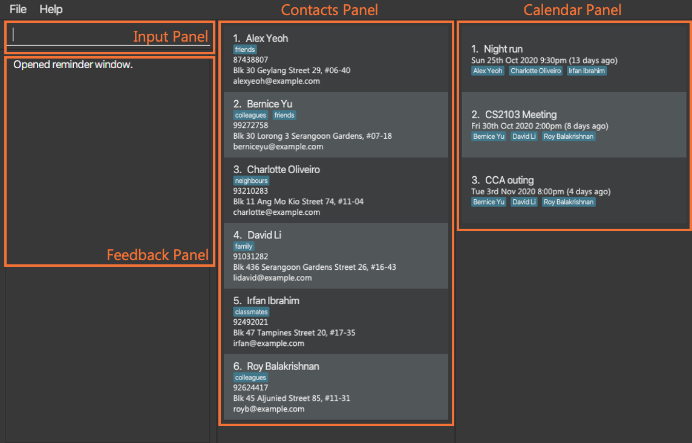

1. Type the command in the command box and press <kbd>Enter</kbd> to execute it. e.g. typing **`help`** and pressing <kbd>Enter</kbd> will
   open the help window. 
   
   Some commands you can try:

   * **`list`**`-c` : Lists all contacts.

   * **`add`**`-c n/John Doe p/98765432 e/johnd@example.com a/John street, block 123, #01-01` : Adds a contact named `John Doe` to Athena.

   * **`delete`**`-e 3` : Deletes the 3rd event shown in the current list.

   * **`add`**`-e d/Meeting at/12-12-1234 12:34` : Adds an event named `Meeting` to Athena.

   * **`exit`** : Exits the app.

1. Refer to the [Features](#features) below for details of each command.

## 4. Features [Illio Suardi]

Athena supports two key functionalities - the management of **contacts** and **events**. Commands are tailored to manage 
each of these specific functionalities.

Athena also supports two sub-functionalities:
* contacts may have **tags** of specific key-words so they can be better categorised,
* events may have **reminders** to remind you of upcoming ones.

Thus, there are **five** types of commands:

* [general](#41-general) - commands that do not target any specific functionality
* [contact](#42-contacts) - commands that target contacts, distinguished by `-c`
* [event](#43-events) - commands that target events, distinguished by `-e`
* [tag](#44-tags) - commands that target tags, distinguished by `-t`
* [reminder](#45-reminders-wu-bangyi) - commands that target reminders, distinguished by `-r`

### Command Format
**:information_source: Notes about the command format:** 

* Words in `UPPER_CASE` are the parameters to be supplied by the user. 
  e.g. in `add n/NAME`, `NAME` is a parameter which can be used as `add n/John Doe`.

* Items in square brackets are optional. 
  e.g `n/NAME [t/TAG]` can be used as `n/John Doe t/friend` or as `n/John Doe`.

* Items with `…`​ after them can be used any number of times. 
  e.g. `[t/TAG]…​` can be used as ` ` (i.e. 0 times), `t/friend`, `t/friend t/family` etc.

* Parameters can be in any order. 
  e.g. if the command specifies `n/NAME p/PHONE_NUMBER`, `p/PHONE_NUMBER n/NAME` is also acceptable.
  
* Commands that do not make changes to data in the address book can be followed by anything. 
  e.g. `list -e` and `list -e asdfg` both list all events.
  
* Commands that take in a single input per prefix will default to the last one if multiple are entered. 
  e.g. `add -c n/John n/Peter` will add a contact named `Peter` to Athena.

### 4.1 General [Illio Suardi]

#### 4.1.1 Viewing help - `help`

Shows a message explaining how to access the help page.

Format: `help`

#### 4.1.2 Exiting the program - `exit`

Exits the program.

Format: `exit`

### 4.2 Contacts

#### 4.2.1 Adding a contact - `add` [Wu Bangyi]

You can use this command to add a contact into Athena's address book.

Format: `add -c n/NAME [p/PHONE_NUMBER] [e/EMAIL] [a/ADDRESS] [t/TAG]…​`

:bulb: **Tip:**
A contact can have any number of tags (including 0)

:bulb: **Tip:**
If you are missing some information like ADDRESS, you can just remove the prefix and leave the field empty. 

Example:
* `add -c n/Betsy Crowe t/friend p/1234567 t/criminal`

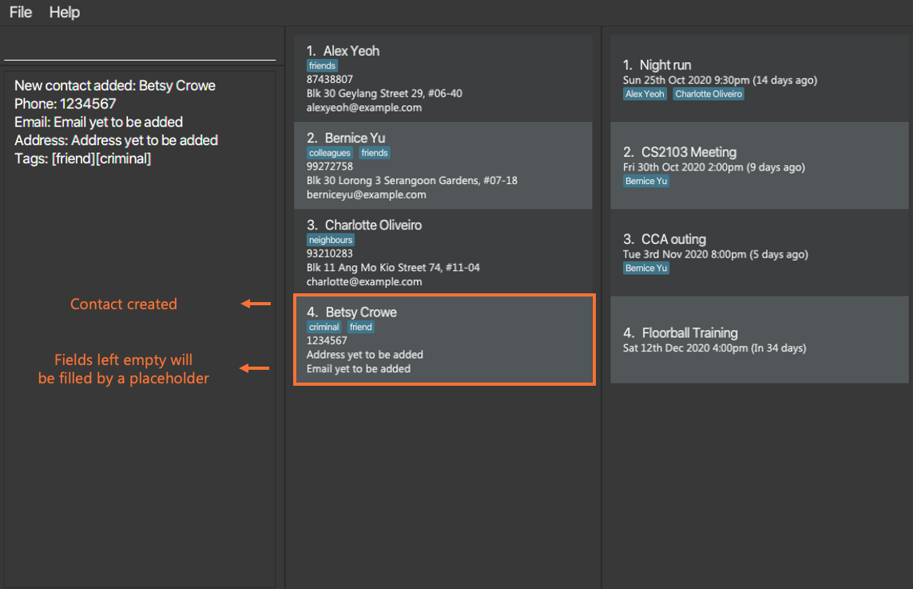

#### 4.2.2 Clearing all contacts - `clear` [Wu Bangyi]

You can use this command to permanently clear all of Athena's contacts.

Format: `clear -c`

#### 4.2.3 Deleting a contact - `delete` [Wu Bangyi]

You can use this command to delete specified contact(s).

Format: `delete -c CONTACT_INDEX_LIST`

* Deletes the contact(s) at the specified index(es) in `CONTACT_INDEX_LIST`.
* The index refers to the index number shown in the displayed contact list.
* The index **must be a positive integer** 1, 2, 3, …​
* Deleted contacts will also be removed from any event they attend.

:bulb: **Tip:**
You can delete multiple contacts at once by entering multiple corresponding indices with a comma in between (e.g. 3,1,2).

Examples:
* `list -c` followed by `delete -c 2,3` deletes the 2nd and 3rd contact in Athena.
* `find -c n/Betsy` followed by `delete -c 1` deletes the 1st contact in the results of the `find` command.

#### 4.2.4  Deleting contacts by Tag - `deletebytag` [Wu Bangyi]

You can use this command to delete all contacts with a specified tag.

Format: `deletebytag -c TAG`

* The tag must be a valid tag.
* Deleted contacts will also be removed from any event they attend.

:bulb: **Tip:**
Since all contacts with the specified tag will be deleted permanently, we recommend you to list out 
all those contacts first to make sure you are aware of which contacts will be deleted. 
You can do this by using `find -c t/TAG`. 

Example:

1. Entering `deletebytag -c computing` into the user input panel will delete all the contacts tagged under computing.
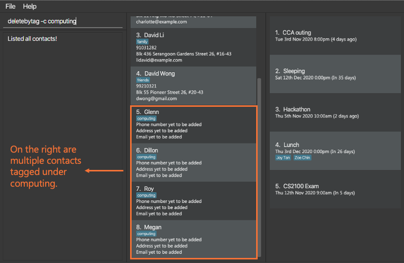

2. As shown below, all contacts tagged under computing have been successfully deleted.

#### 4.2.5 Editing a contact - `edit` [Chan Jun Da]

You can use this command to edit a specific contact.

Format: `edit -c INDEX [n/NAME] [p/PHONE] [e/EMAIL] [a/ADDRESS] [t/TAG]… [rt/TAG]…`

* Edits the contact at the specified `INDEX`.
* The index refers to the index number shown in the displayed contact list.
* The index **must be a positive integer** 1, 2, 3, …
* At least one of the optional fields must be provided.
* Existing values will be updated to the input values.
* Tags that are not mentioned will *NOT* be affected.
* `t/TAG` adds `TAG` to the contact.
* `rt/TAG` removes `TAG` from the contact.
* Tag removal is done before tag addition.
* You can remove all the contact’s tags by typing `rt/*`.

Examples:
* `edit -c 1 p/91234567 e/johndoe@example.com` Edits the phone number and email address of the 1st contact to be `91234567` 
and `johndoe@example.com` respectively.
* `edit -c 2 n/Betsy Crower t/CS2030` Edits the name of the contact at index `2` to be `Betsy Crower` and adds the tag `cs2030` (example illustrated below).
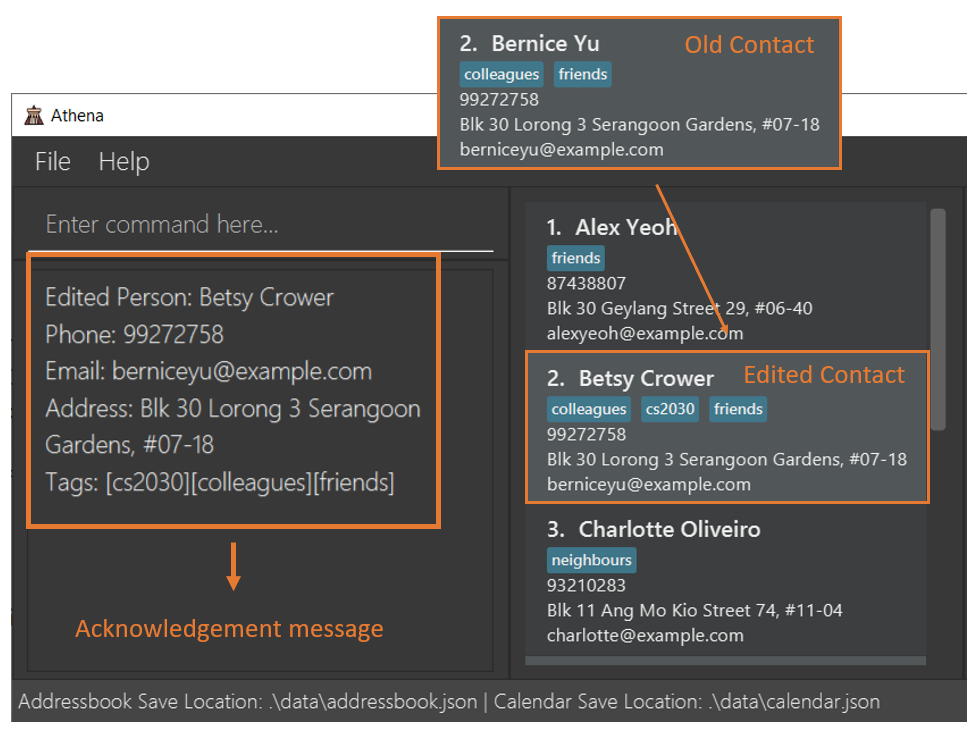

* `edit -c 3 t/CS2103 rt/*` Removes all tags of the contact at index `3` and then adds the tag `cs2103` to it.

#### 4.2.6 Finding a contact - `find` [Chan Jun Da]

You can use this command to find a particular contact by applying multiple search filters.

Format: `find -c [n/KEYWORDS] [p/PHONE] [e/EMAIL] [a/ADDRESS] [t/TAG]…`

* Search field must contain at least one of the optional fields.
* The search is case-insensitive for all fields. e.g `hans` will match `Hans`
* For name keywords (`n/KEYWORDS`),
    * only full words will be matched. e.g. `Han` will not match `Hans`
    * you can specify multiple words you would like to match. e.g. `n/Hans John`
    * a match is found if the contact's name has at least one of the keywords (i.e. `OR` search).
    * the order of the name keywords does not matter. e.g. `Hans Bo` will match `Bo Hans` e.g. `Hans Bo` will return `Hans Gruber`, `Bo Yang`
* The `t/TAG` specifier must use an existing tag and does not support partial tag-name matches.
* For `p/PHONE`, `e/EMAIL`, `a/ADDRESS` specifiers, a contact matches the field if its corresponding field contains the specific specifier. (i.e. `a/Serangoon` will match any address that contains `Serangoon`)
* If more than one specifier is included, only contacts matching all specifier details
 will be returned. `find n/John a/Serangoon` will return only contacts whose names contain `John` **and** with 
 `Serangoon` as part of the address.

Examples:
* `find -c n/John` returns `john` and `John Doe`
* `find -c n/alex david` returns `Alex Yeoh`, `David Li` (example illustrated below).

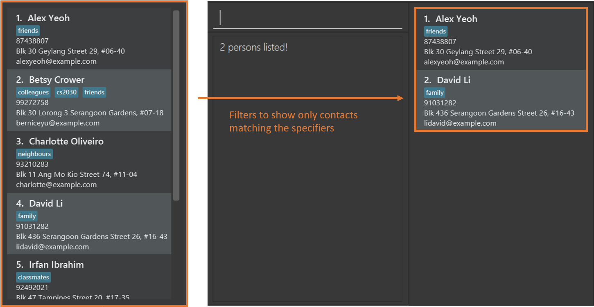

* `find -c a/Serangoon` returns all contacts with an address that contains `Serangoon` 
* `find -c n/alex david e/gmail` returns `Alex Tan e/...@gmail.com` and `David Lim e/...@gmail.com` but not 
`Alex Yeoh e/...@hotmail.com` 

#### 4.2.7 Listing all contacts - `list` [Wu Bangyi]

You can use this command to list out all contacts.

Format: `list -c`

#### 4.2.8 Sorting displayed contacts - `sort` [Wu Bangyi]

You can use this command to sort all currently displayed contacts in Athena.

Format: `sort -c INDEX`

:information_source: **Temporary Sorting:**
The order of sorting will reset to default whenever Athena is rebooted. 

* Index must be a number from 1 to 3 and they each indicate a specific ordering sequence.
* Index definitions:
1. By alphabetical order of their names.
2. By alphabetical order of their address.
3. By alphabetical order of their email.

Example:
* `sort -c 1` would sort all currently displayed contacts by their name in alphabetical order.

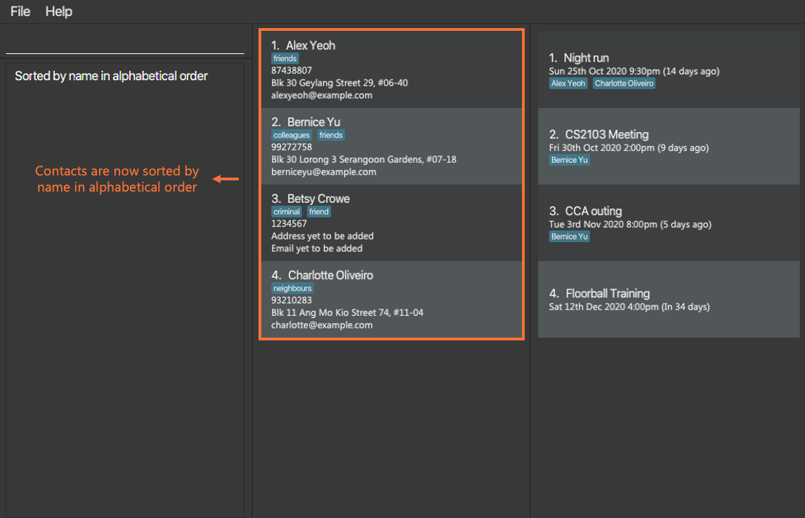

#### 4.2.9 Sorting displayed contacts permanently - `psort` [Wu Bangyi]

You can use this command to sort all of Athena's contacts permanently.

Format: `psort -c INDEX`

* Index must be a number from 1 to 3 and they each indicate a specific ordering sequence.
* Index definitions:
1. By alphabetical order of their names.
2. By alphabetical order of their address.
3. By alphabetical order of their email.

Example:
* `psort -c 2` would sort all contacts by their address in alphabetical order.

### 4.3 Events

#### 4.3.1 Adding an event - `add` [Hendey Fan]

You can use this command to add an event to Athena's calendar.

Format: `add -e d/DESCRIPTION at/DATE_TIME [ap/CONTACT_INDEX_LIST]`

* `CONTACT_INDEX_LIST` are the indices of contacts in the middle panel you want to add to the event.
* You can add all the attendees from the contact list to the event by using `ap/*`.

:bulb: **Tip:**
You can add multiple attendees at once by entering multiple corresponding indices with a comma in between (e.g. 3,1,2).

`DATE_TIME` formats currently accepted [Kim Sol, Hendey Fan]
* d-M-y H:m
* y-d-M H:m
* 2 digit inputs for `y` will automatically be in the 21st century. (e.g. `20` is interpreted as the year 2020)
* The following symbols can be used interchangeably to indicate date, time and year of the event.
    * [.] (full stop)
    * [/] (forward slash)
    * [-] (hyphen)
    * [:] (colon)
* For example, 12/10.2020 12:00 can be keyed in by the user, and will be registered as 12th October 2020, 12pm.

Legend:

Short form | What it represents
----------- | -----------
d | Day of month (e.g. `7`, `23`)
M | Month of year (e.g. `2`, `10`)
y | Year (e.g. `20`, `2020` both means the year 2020)
H | Hour of the day in 24-hr time (e.g. `8`, `23`)
m | Minutes of an hour (e.g. `9`, `45`)

Examples:
* `add -e at/20-10-20 14:00 d/CS2103 Team meeting ap/5,1,3` Adds an event with the description "CS2103 Team meeting", at 20th October 2020, 2pm. With persons 5, 1 and 3 from the contact list. 
* `add -e d/CS2103 Team meeting at/20-10-2020 14:00 ap/1,2,3` Adds an event with the description "CS2103 Team meeting", at 20th October 2020, 2pm. With persons 1, 2 and 3 from the contact list.

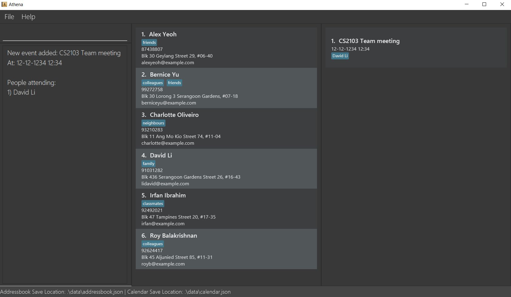

#### 4.3.2 Clearing all events - `clear` [Kim Sol]

You can use this command to clear the events in your calendar all at once.

Format: `clear -e`

:exclamation: **WARNING:** :exclamation: **All events will be deleted following the use of this command! (shown below)**

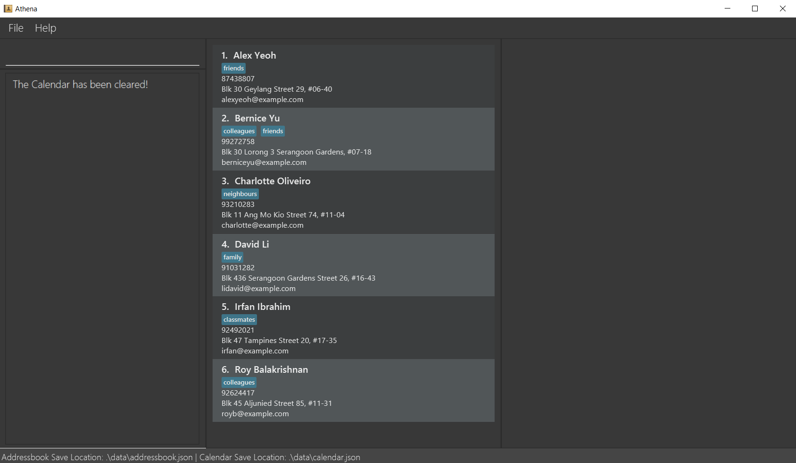

#### 4.3.3 Deleting an event - `delete` [Hendey Fan]

You can use this command to delete a specified event in your calendar.

Format: `delete -e EVENT_INDEX_LIST`

* Deletes the event(s) at the specified index(es) in `EVENT_INDEX_LIST`.
* The index refers to the index number shown in the displayed event list.
* The index **must be a positive integer** 1, 2, 3, ...

:bulb: **Tip:**
You can delete multiple events at once by entering multiple corresponding indices with a comma in between (e.g. 3,1,2).

Examples:
* `list -e` followed by `delete -e 2,3` deletes the 2nd and 3rd event in Athena.

#### 4.3.4 Editing an event - `edit` [Hendey Fan]

You can use this command to edit a specified event.

Format: `edit -e INDEX [d/DESCRIPTION] [at/DATE_TIME]
[ap/CONTACT_INDEX_LIST] [rp/ATTENDEE_INDEX_LIST]`

:information_source: **Please Note:**
`DATE_TIME` for this command follows the same formats as the `DATE_TIME` in adding an event (`add -e`) command.

[Click here to jump to: `Adding an event`](#431-adding-an-event---add-hendey-fan)

* Edits the event at the specified INDEX. 
* The index must be a positive integer 1, 2, 3, ...
* At least one of the optional fields must be provided.
* Existing values will be updated to the input values.
* `[ap/CONTACT_INDEX_LIST]` adds contacts with the specified indices to the event.
* `[rp/ATTENDEE_INDEX_LIST]` removes contacts with the specified indices from the event.
* You can add all the attendees from the contact list to the event by using `ap/*`.
* You can remove all the attendees for the event by using `rp/*`.

:bulb: **Tip:**
You can add/remove multiple attendees at once by entering multiple corresponding indices with a comma in between (e.g. 3,1,2).

Examples:
* `edit -e 1 d/CS2101 Tutorial at/23-10-1234 12:30` Edits the details and datetime of the 1st event to be CS2101 Tutorial and 23-10-1234 12:30 respectively.
* `edit -e 2 at/23-10-1234 12:30` Edits the time of the 2nd event to be 23-10-1234 12:30
* `edit -e 1 ap/1,2 rp/1,2` Adds the contacts at index 1 and 2 from the contact list to event 1 attendees list. Removes the first 2 contacts from event 1 attendees list.

Picture example:

1. Entering edit command "edit -e 1 ap/1,2 rp/1,2" to edit the participants of CS2103 Meeting.

2. Event participants successfully edited.

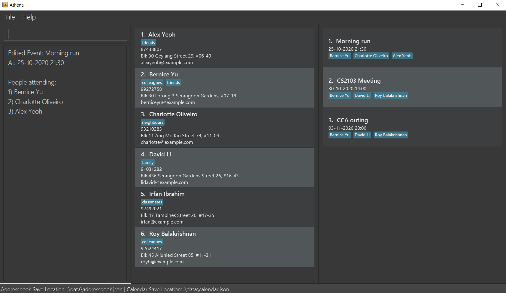

#### 4.3.5 Finding an event - `find` [Kim Sol]

You can use this command to search for a specific event or events using keywords matching the event name.

Format: `find -e KEYWORD`

* The search is case-insensitive. e.g `meeting` will match `Meeting`.
* If the event contains the particular keyword in the command, the corresponding event will appear.
* Only full words will be matched e.g. `meetin` will not match `meeting`.

Examples:
* `find -e Meeting` returns events named as `CS2103 Meeting` and `CS2101 meeting`.
* `find -e seminar` returns events named as `CS Seminar` and `seminar 1`.
* `find -e dinner` returns event named as `Family Dinner`.

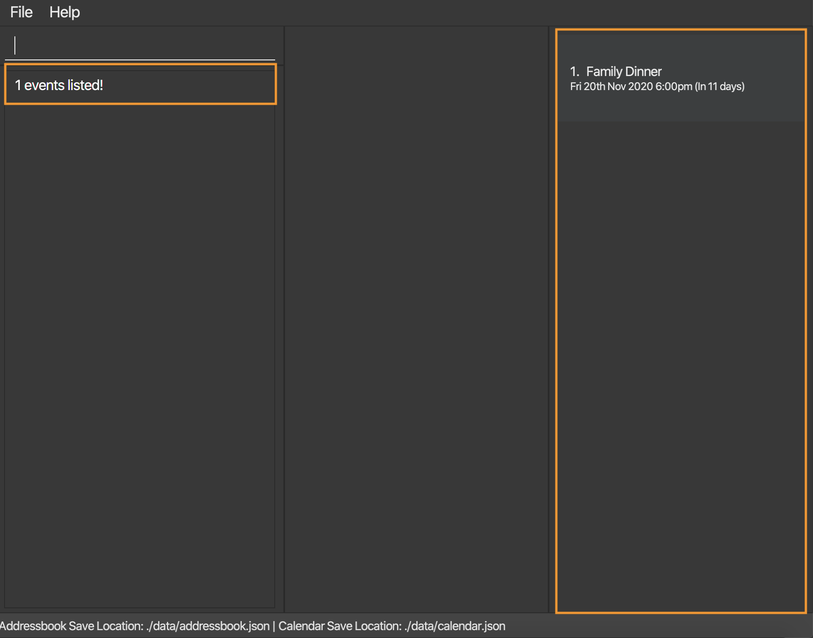

#### 4.3.6 Listing all events - `list` [Kim Sol]

You can use this command to display all the events in your calendar.

Format: `list -e`

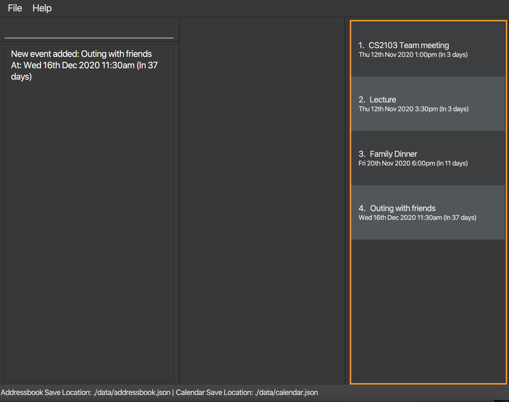

#### 4.3.7 Sorting displayed events - `sort` [Kim Sol]

You can use this command to sort through your currently displayed list of events. You can choose the sorting order by
keying in a specific index.

Format: `sort -e INDEX`

* Sorts through all events currently on screen and lists them according to the user-requested order.
* Index definitions:
    * 1: By lexicographical order of the events' descriptions.
    * 2: By lexicographical order of the events' timing.

Examples:
* `sort -e 1` Sorts all currently displayed events by their descriptions in alphabetical order.

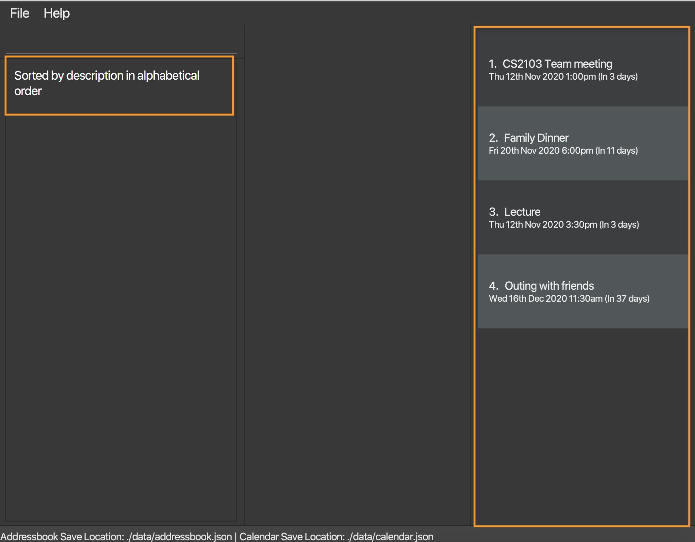

* `sort -e 2` Sorts all currently displayed events by their timings in chronological order.

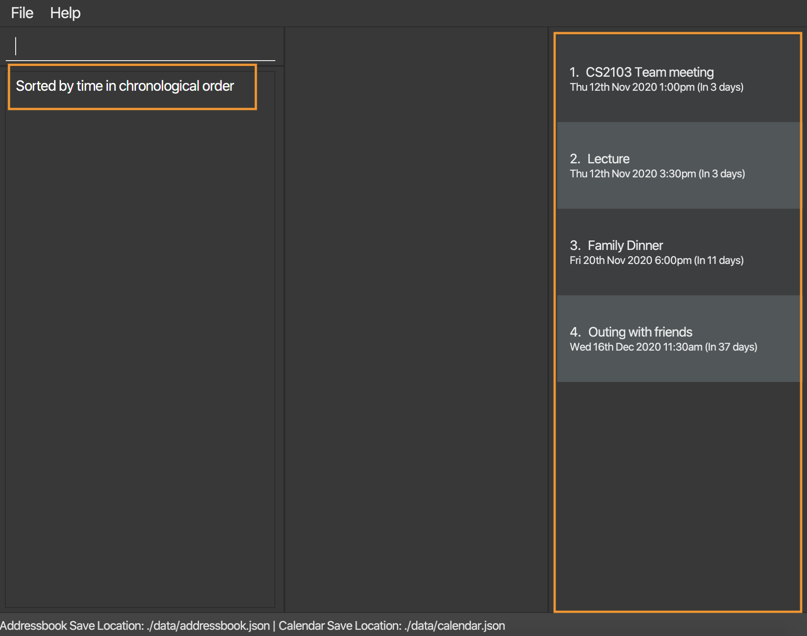

#### 4.3.8 Viewing an event - `view` [Hendey Fan]

You can use this command to view the details of your event.
Details include:
* Description
* Time
* Complete information of all the attendees (phone number, address etc.)

:bulb: **Tip:**
When the number of attendees exceed 6, only 6 attendees will be shown and the rest is hidden.
To view all the attendees, use this command.

Format: `view -e INDEX`
* The index refers to the index number shown in the displayed event list.
* The index **must be a positive integer** 1, 2, 3, ...

Example:
* `view -e 1` Shows the details (as specified above) for the event indexed at 1.

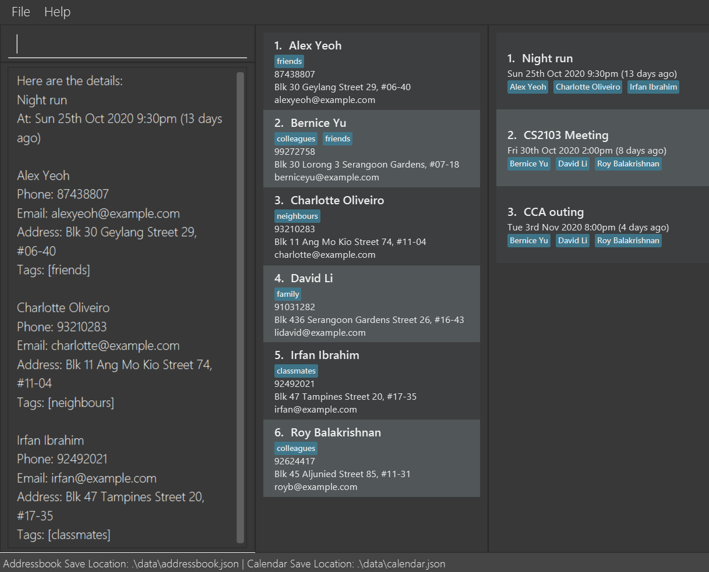

### 4.4 Tags [Chan Jun Da]

Tags present a new way for you to classify and group your contacts together. Managing your tags properly will allow you to perform tag-level actions.
Tag management features are advanced features meant for more proficient users of Athena who have a large number of contacts and events to manage.
Below are some commands to facilitate tag management.

**Notes**: 
* **Tags can exist without being displayed within the contact panel.** I.e. A super-tag with no contacts directly associated with it will not show up on any of the contacts in the contact panel.
* **For a tag to exist, it has to have at least one contact tagged OR contains at least one child-tag.**
Tags that do not meet this criterion will be deleted.  
* **Tags are lowercase alphanumeric only. Spaces or other symbols are not supported.** A tag with uppercase 
letters is changed to lowercase only. This is to allow you to perform tag actions more easily without having to worry about the casing of the original tag.

#### 4.4.1 Adding a tag - `add` [Chan Jun Da]

Adds a new tag to Athena. Use this when you want to retroactively assign contacts to a tag and/or classify a group 
of tags under one parent-tag.

Format: `add -t n/TAG_NAME [i/CONTACT_INDEX]… [t/CHILD_TAG]…`

* `TAG_NAME` must be alphanumeric with no spaces.
* At least one of `CONTACT_INDEX` or `CHILD_TAG` must be provided.
* `CONTACT_INDEX` refers to the index of a contact as is shown in the contact panel.
* `CONTACT_INDEX` must be a positive integer.
* `TAG_NAME` must not be a tag that already exists.
* `CHILD_TAG`s specified must already exist in Athena.

Examples:
* `add -t n/cs2103 i/1` Creates a new tag `cs2103` and assigns contact at index `1` the tag `cs2103` (example illustrated below).
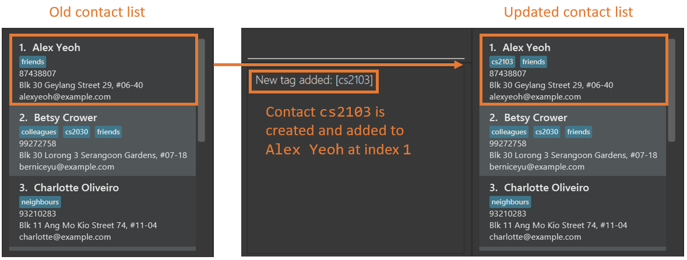

* `add -t n/computing i/1 i/2 t/cs2030 t/cs2040` Creates a new tag `computing`. Contacts at indices `1` and `2` 
will be assigned the `computing` tag. `cs2030` and `cs2040` are assigned as child-tags of `computing`.

#### 4.4.2 Deleting a tag - `delete` [Chan Jun Da]

Deletes a tag from Athena. Use this when you would like to remove a specific tag from Athena instead of manually editing each contact with the tag. 
Additionally, if you would like to delete a tag and all its sub-tags, you can specify `true` under the `r/` input field.

Format: `delete -t t/TAG_NAME [r/BOOLEAN]`

* `TAG_NAME` must be the name of an existing tag in Athena.
* `BOOLEAN` must be of the form `1`, `t`, `true` for true or `0`, `f`, `false` for false.
* `r/BOOLEAN` field is optional. The default value for this field is `false`.
* **Note**: On single `tag` deletion, every parent-tag of `tag` will be reconnected to every child-tag of `tag` (as shown by the image below).

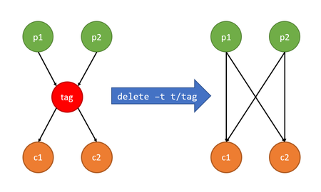 

Examples:
* `delete -t t/cs2030` Deletes the tag `cs2030` (example illustrated below).
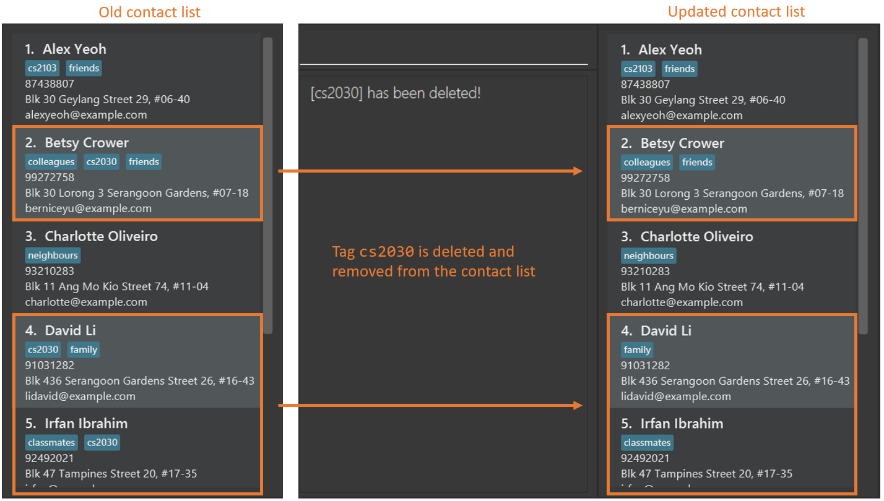

* `delete -t t/computing r/t` Deletes the tag `computing` and all its sub-tags.

#### 4.4.3 Editing a tag - `edit` [Chan Jun Da]

Edits an existing tag in Athena. Use this when you would like perform either or both of the following functionalities:
- add and/or remove contacts from a tag
- add and/or remove child-tags from a tag

Format: `edit -t n/TAG_NAME [i/INDEX_ADD]… [ri/INDEX_REMOVE]… [t/TAG_ADD]… [rt/TAG_REMOVE]…` 

* `TAG_NAME` specified must be of an existing tag.
* At least one of the optional fields must be provided.
* `INDEX` refers to the contact currently being displayed at `INDEX` in the contact panel.
* Contacts at `INDEX_ADD`s must not have `TAG_NAME` as a tag.
* Contacts at `INDEX_REMOVE`s must have `TAG_NAME` as a tag.
* `TAG_ADD`s must be existing tags that are not already child-tags of `TAG_NAME`.
* `TAG_REMOVE`s must be existing child-tags of `TAG_NAME`.

Examples:
* `edit -t n/computing i/1 i/2` Adds the contacts at indices `1` and `2` to `computing` (example illustrated below).
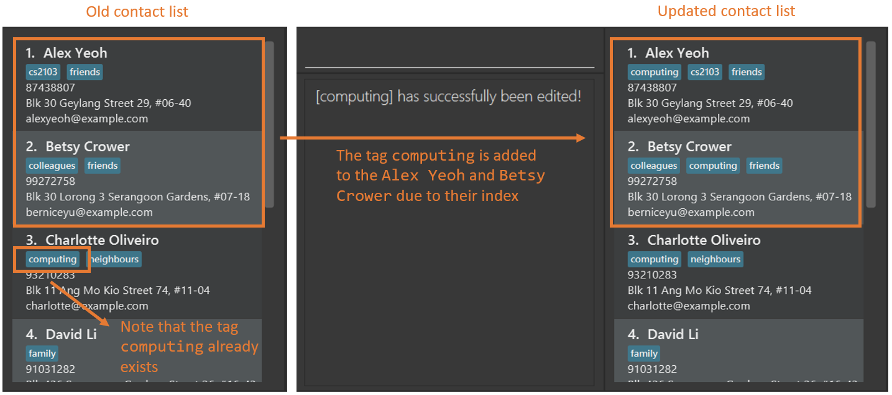

* `edit -t n/computing ri/1 t/cs2030 rt/cs2040` Removes the contact at index `1` from `computing`. Also, adds `cs2030` as a child-tag to `computing` and removes `cs2040` as a child-tag.

#### 4.4.4 Finding a tag - `find` [Illio Suardi]

You can use this command to find tags which names partially match the given keyword by listing them in the remarks panel.
Super-tags are also denoted with `(supertag)`. Additionally, if you would like to find super-tags only, you can specify
`true` in the `st/` field; conversely, if you would like to find regular tags only, you can specify `false` in the `st/` field.

Format: `find -t [t/KEYWORD] [st/BOOLEAN]`

* At least one of the optional fields must be provided.
* The search is case-insensitive. e.g. `hans` will match `Hans`
* The search can match words partially. e.g. `han` will match both `han` and `hans`
* `BOOLEAN` must be of the form `1`, `t`, `true` for a true case or `0`, `f`, `false` for a false case.

Examples:
* `find -t st/1` Finds all super-tags.
* `find -t t/computing` Finds tags that partially contain the word `computing`.
* `find -t t/friends st/0` Finds regular tags that partially contain the word `friends` (example illustrated below).

#### 4.4.5 Listing all tags - `list` [Chan Jun Da]

Lists all tags in the remarks panel including the corresponding contacts of each tag. Super-tags are also denoted with `(supertag)`.

Example:
* `list -t` In the remarks panel, a list of all tags and their contacts are displayed (example illustrated below).
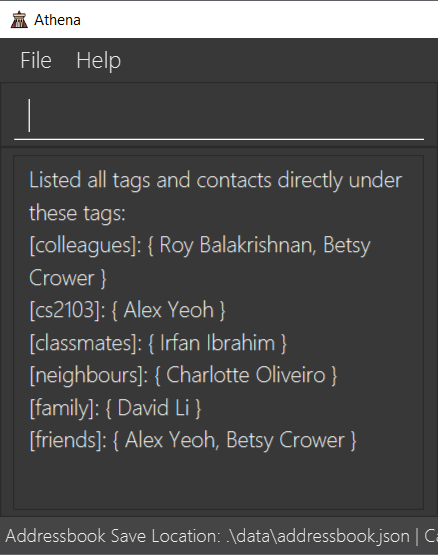

#### 4.4.6 Viewing tags - `view` [Chan Jun Da]

Shows specific details of a tag. Use this when you would like to view full details of a tag.
Details include:
- Child-tags
- Contacts tagged with the specified tag
- All other sub-tags
- All other contacts containing sub-tags

Format: `view -t t/TAG [t/TAG]…`

* `TAG` must be a valid existing tag in Athena.

Example:
* `view -t t/friends` Shows the details (as specified above) for the tag `friends` only (example illustrated below).
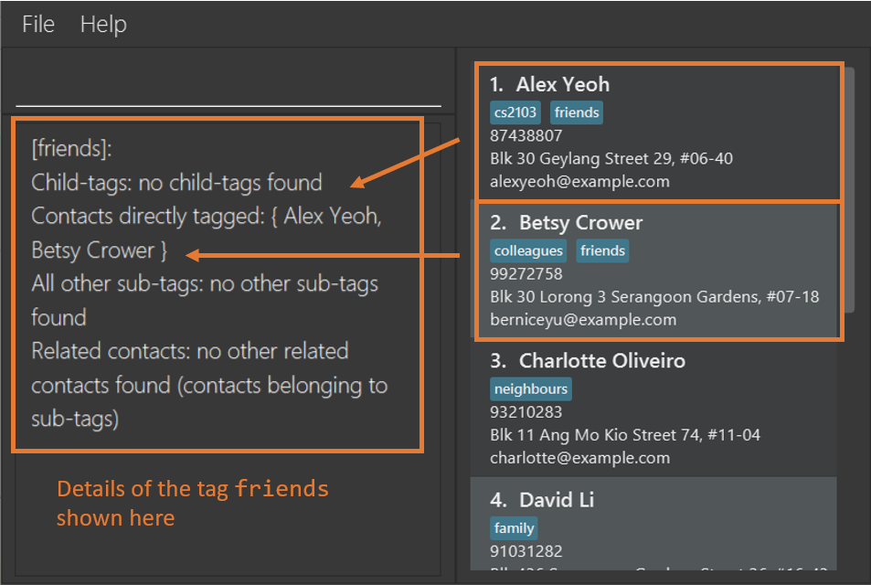
_Note that for the above image, the tag `friends` does not contain sub-tags._

* `view -t t/cs2030 t/cs2040` Shows the details for the tags `cs2030` and `cs2040` in a sequential order.

---

### 4.5 Reminders [Wu Bangyi]

Reminders allow you to set custom reminders for your events. You can call up your reminders in application or have them
display through an alert window whenever Athena starts.

:information_source: **Notes**: 
* **Reminders are always coupled to a valid event in your calendar.** I.e. If an event is removed, any reminder for
that event will also be removed. 
* **Obsolete reminders are deleted automatically.** I.e. The moment an event has passed, the reminder will be automatically
deleted by Athena.

#### 4.5.1 Adding a reminder - `add`

You can use this command to set a new reminder for a pre-existing event. 

Format: `add -r EVENT_INDEX in/DAYS`

* `EVENT_INDEX` refers to the index of an event as is shown in the event window.
* `DAYS` refers to the number of days in advance for the reminder to start showing in the pop-up window.

Examples:

1. After entering the command "add -r 5 in/3". A reminder for the 5th event "CS2100 Meeting" will be set.

2. Since event 5 is on **12th Nov**, the reminder will be activated three days 
before then, starting on **9th Nov**.
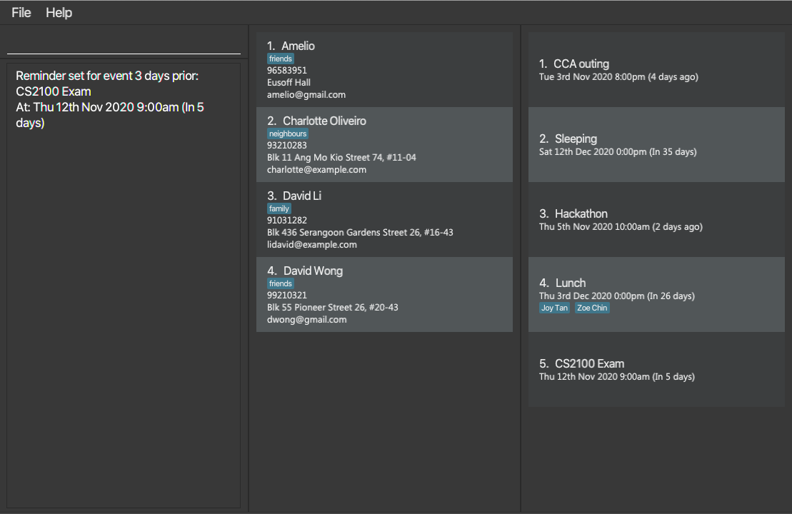
3. When reminders are active, every time Athena is opened, the alert window will pop up as shown below.

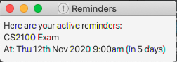

#### 4.5.2 Listing all reminders - `list`

You can use this command to display all your reminders.

Example:
* `list -r` 

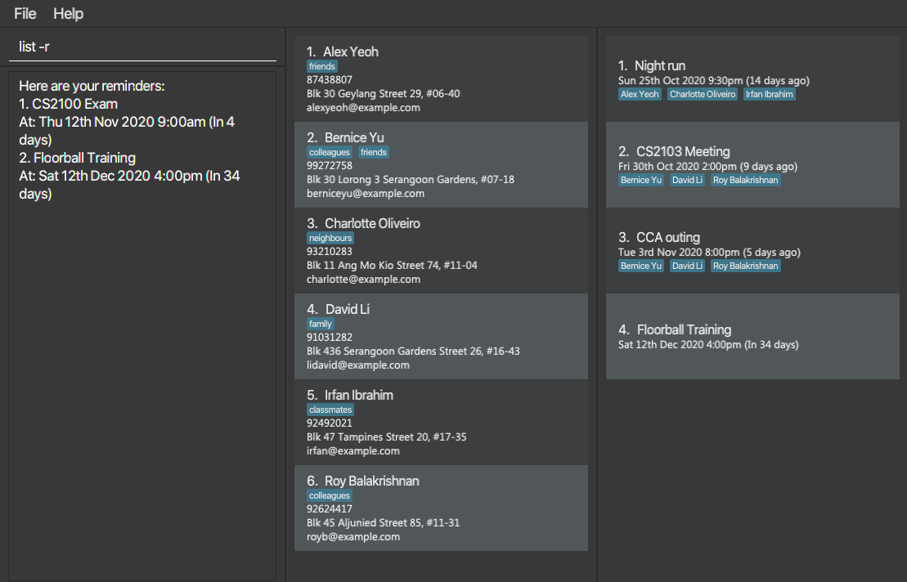

#### 4.5.3 Deleting a reminder - `delete`

You can use this command to delete a specified reminder.

Format: `delete -r INDEX`

* Deletes the reminder at the specified `INDEX`.
* The index refers to the index number shown in the displayed list of reminders.
* You can get the displayed reminder list by using `list -r`
* The index must be a positive integer 1, 2, 3, ...

Examples:
* `list -r` (refer to the list diagram above) followed by `delete -r 2` deletes the 2nd reminder in the list of reminders.

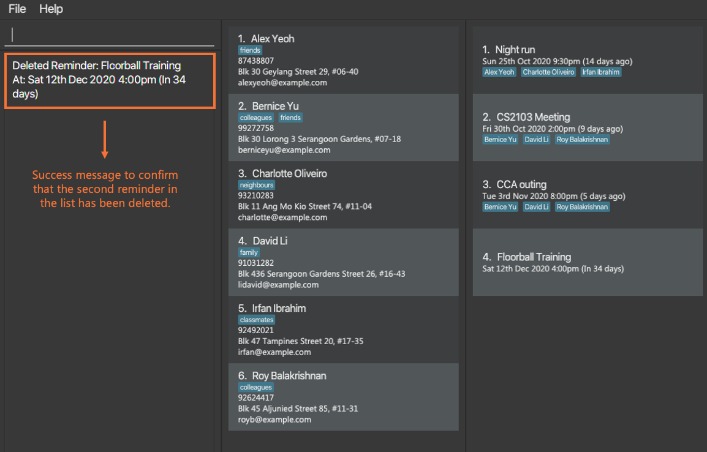

### 5. Upcoming features [Chan Jun Da]

#### 5.1 Viewing tag tree (coming soon) - `viewtree`

Displays a visual representation of tag-to-tag relationships that currently exist in Athena. This upcoming feature will allow you to easily understand the current tag structure that they have built.

A preview image is shown below for you to understand what this feature will look like.
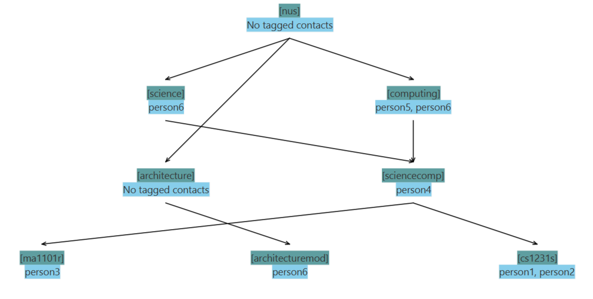

Format: `viewtree -t`
* Displays the current tag tree in Athena.
* For each tag, a summary of contacts directly tagged with it is shown. If there are too many contacts, only the first few will be shown together with a number indicating the number of undisplayed contacts.

### 6. Data saving

Athena's data is saved in the hard disk automatically after **any command that changes the data**. Thus, there is no
need to save manually. 

## 7. FAQ

**Q**: Where are the save files that Athena uses stored? 
**A**: The default save directory is in `{Athena home directory}/data`.

**Q**: What are the save files that Athena uses? 
**A**: Athena uses three separate save files. They are `addressbook.json`, `calendar.json` and `tagtree.json`.

**Q**: How do I transfer my data to another computer? 
**A**: Download the app on the other computer and overwrite the empty data files it creates with the three save files from the previous computer. 

## 8. Command summary

Action | Format, Examples
--------|------------------
**Add Contact** | `add -c n/NAME p/PHONE_NUMBER e/EMAIL a/ADDRESS [t/TAG]…​`   e.g., `add -c n/James Ho p/22224444 e/jamesho@example.com a/123, Clementi Rd, 1234665 t/friend t/colleague`
**Add Event** | `add -e d/DESCRIPTION at/DATE_TIME [ap/CONTACT_INDEX_LIST]`  e.g., `add -e d/CS2103 Team meeting at/20-10-2020 14:00 ap/5,1,3`
**Add Tag** | `add -t n/TAG_NAME [i/CONTACT_INDEX]… [t/CHILD_TAG]…`   e.g., `add -t n/computing i/1 i/2 t/cs2030 t/cs2040`
**Add Reminder** | `add -r [EVENT_INDEX] [in/DAYS]`
**Clear Contacts** | `clear -c`
**Clear Events** | `clear -e`
**Delete Contact** | `delete -c CONTACT_INDEX_LIST`  e.g., `delete -c 3,1,2`
**Delete Contacts By Tag** | `deletebytag -c TAG`  e.g., `delete -c computing`
**Delete Event** | `delete -e EVENT_INDEX_LIST`  e.g., `delete -e 3,1,2`
**Delete Tag** | `delete -t t/TAG_NAME [r/BOOLEAN]`   e.g., `delete -t t/computing r/t`
**Delete Reminder** | `delete -r INDEX`   e.g., `delete -r 1`
**Edit Contact** | `edit -c INDEX [n/NAME] [p/PHONE] [e/EMAIL] [a/ADDRESS] [t/TAG]… [rt/TAG]…`  e.g.,`edit -c 2 n/James Lee e/jameslee@example.com`
**Edit Event** | `edit -e INDEX [d/DESCRIPTION] [at/DATE_TIME] [ap/CONTACT_INDEX_LIST] [rp/ATTENDEE_INDEX_LIST]`  e.g., `edit -e 1 d/CS2101 Tutorial at/23-10-1234 12:30 ap/1,2,3 rp/1,2`
**Edit Tag** | `edit -t n/TAG_NAME [i/INDEX_ADD]… [ri/INDEX_REMOVE]… [t/TAG_ADD]… [rt/TAG_REMOVE]…`   e.g., `edit -t n/computing ri/1 t/cs2030 rt/cs2040`
**Exit** | `exit`
**Find Contact** | `find -c [n/KEYWORDS] [p/PHONE] [e/EMAIL] [a/ADDRESS] [t/TAG]…`  e.g., `find -c n/alex david e/gmail`
**Find Event** | `find -e KEYWORD`  e.g., `find -e Seminar`
**Find Tag** | `find -t [t/KEYWORD] [st/BOOLEAN]`  e.g., `find -t t/computing`
**Help** | `help`
**List Contact** | `list -c`
**List Events** | `list -e`
**List Tags** | `list -t`
**List Reminders** | `list -r`
**Sort Contacts** | `sort -c INDEX`
**Sort Contacts Permanently** | `psort -c INDEX`
**Sort Events** | `sort -e INDEX`
**View Event** | `view -e INDEX`   e.g., `view -e 1`
**View Tags** | `view -t t/TAG [t/TAG]…`   e.g., `view -t t/cs2030 t/cs2040`

## 9. Glossary [Chan Jun Da]

###### _Child-tag_ 
- A _child-tag_ of a tag signifies a directional relation from a tag to its _child-tag_. It allows for some commands that affect a tag to also affect its _child-tag_. The reverse cannot be done.
The other tag in the relation is known as a [_parent-tag_](#parent-tag).

###### _Parent-tag_ 
- A _parent-tag_ of a tag signifies a directional relation from a _parent-tag_ to a tag. It allows for some commands that affect a _parent-tag_ to also affect the other tag in the relation. The reverse cannot be done.
The other tag in the relation is known as a [_child-tag_](#child-tag).

###### _Tag tree_
- A _tag tree_ (or more accurately a tag graph) is a data structure that tracks tags in Athena and the directional (parent-child) relations between the tags.

###### _Sub-tag_
- A _sub-tag_ of a tag signifies a multi-step directional relation from a tag to the _sub-tag_ (i.e. a sub-tag of a tag is a [child-tag](#child-tag), or a child-tag of a child-tag, etc.). See also [_super-tag_](#super-tag).

###### _Super-tag_
- A _super-tag_ of a tag signifies a multi-step directional relation from the _super-tag_ to the tag. (i.e. a super-tag of a tag is a [parent-tag](#parent-tag), or a parent-tag of a parent-tag, etc.). See also [_sub-tag_](#sub-tag).
