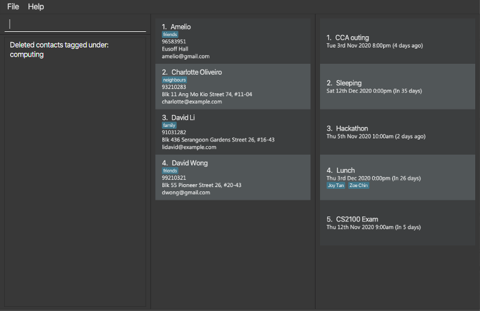
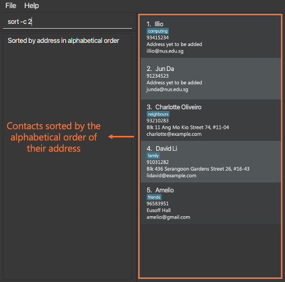

This document is a *User Guide* for Athena, a contact- and event- management desktop application. For more details on
the suitability and functionalities of the application for your usage, please refer to the [Introduction](#Introduction)
section below.

#### Table of Contents

* [Introduction](#introduction)
* [Quick Start](#quick-start)
* [Features](#features)
    * [General](#general)
        * [`help`](#viewing-help---help) - Viewing help
        * [`exit`](#exiting-the-program---exit) - Exiting the program
    * [Contacts](#contacts)
        * [`add`](#adding-a-contact---add) - Adding a contact
        * [`clear`](#clearing-all-contacts---clear) - Clearing all contacts
        * [`delete`](#deleting-a-contact---delete) - Deleting a contact
        * [`edit`](#editing-a-contact---edit) - Editing a contact
        * [`find`](#finding-a-contact---find) - Finding a contact
        * [`list`](#listing-all-contacts---list) - Listing all contacts
        * [`sort`](#sorting-displayed-contacts---sort) - Sorting displayed contacts
        * [`psort`](#sorting-displayed-contacts-permanently---psort) - Sorting contacts permanently
    * [Events](#events)
        * [`add`](#adding-an-event---add) - Adding an event
        * [`clear`](#clearing-all-events---clear) - Clearing all events
        * [`delete`](#deleting-an-event---delete) - Deleting an event
        * [`edit`](#editing-an-event---edit) - Editing an event
        * [`find`](#finding-an-event---find) - Finding an event
        * [`list`](#listing-all-events---list) - Listing all events
        * [`sort`](#sorting-displayed-events---sort) - Sorting displayed events
        * [`view`](#viewing-an-event---view) - Viewing an event
    * [Tags](#tags)
        * [`add`](#adding-a-tag---add) - Adding a tag
        * [`delete`](#deleting-a-tag---delete) - Deleting a tag
        * [`edit`](#editing-a-tag---edit) - Editing a tag
        * [`list`](#listing-all-tags---list) - Listing all tags
        * [`view`](#viewing-tags---view) - Viewing tag details
    * [Reminders](#reminders)
        * [`add`](#adding-a-reminder---add) - Adding a reminder
        * [`delete`](#deleting-a-reminder---delete) - Deleting a reminder
        * [`list`](#listing-all-reminders---list) - Listing all reminders
* [Data saving](#data-saving)
* [FAQ](#faq)
* [Command Summary](#command-summary)
* [Glossary](#glossary)

---

## Introduction

Athena is a **desktop app for managing contacts and events, optimized for use via a Command Line Interface** (CLI) while
still having the benefits of a Graphical User Interface (GUI).

Athena is perfect for you if you:
* need to categorise a huge number of contacts or events,
* need to keep track of the people who attend specific events,
* can type fast!

---

## Quick start

1. Ensure you have Java `11` or above installed in your computer.

1. Download the latest `Athena.jar` from [here](https://github.com/AY2021S1-CS2103T-W10-4/tp/releases).

1. Copy the JAR file to the folder you want to use as the _home folder_ for Athena.

1. Double-click the file or run it with `java -jar Athena.jar` to start the app. A window similar to the one below
   should appear in a few seconds. Note how the app contains some sample data. 
   

1. Type the command in the command box and press Enter to execute it. e.g. typing **`help`** and pressing Enter will
   open the help window. 
   
   Some commands you can try:

   * **`list`**`-c` : Lists all contacts.

   * **`add`**`-c n/John Doe p/98765432 e/johnd@example.com a/John street, block 123, #01-01` : Adds a contact named `John Doe` to Athena.

   * **`delete`**`-e 3` : Deletes the 3rd event shown in the current list.

   * **`add`**`-e d/Meeting at/12-12-1234 12:34` : Adds an event named `Meeting` to Athena.

   * **`exit`** : Exits the app.

1. Refer to the [Features](#features) below for details of each command.

--------------------------------------------------------------------------------------------------------------------

## Features

Athena supports two key functionalities - the management of contacts and events. Thus, commands are tailored to manage 
each of these specific functionalities. In addition, to better categorise contacts, they may also be *tagged* with
specific key-words. Thus, there are **five** types of commands:

* [general](#general) - commands that do not target any specific functionality
* [contact](#contacts) - commands that target contacts, distinguished by `-c`
* [event](#events) - commands that target events, distinguished by `-e`
* [tag](#tags) - commands that target tags, distinguished by `-t`
* [reminder](#reminders) - commands that target reminders, distinguished by `-r`

**:information_source: Notes about the command format:** 

* Words in `UPPER_CASE` are the parameters to be supplied by the user. 
  e.g. in `add n/NAME`, `NAME` is a parameter which can be used as `add n/John Doe`.

* Items in square brackets are optional. 
  e.g `n/NAME [t/TAG]` can be used as `n/John Doe t/friend` or as `n/John Doe`.

* Items with `…`​ after them can be used any number of times. 
  e.g. `[t/TAG]…​` can be used as ` ` (i.e. 0 times), `t/friend`, `t/friend t/family` etc.

* Parameters can be in any order. 
  e.g. if the command specifies `n/NAME p/PHONE_NUMBER`, `p/PHONE_NUMBER n/NAME` is also acceptable.
  
* Commands that do not make changes to data in the address book can be followed by anything. 
  e.g. `list -e` and `list -e asdfg` both list all events.

---

### General

#### Viewing help - `help`

Shows a message explaining how to access the help page.

Format: `help`

#### Exiting the program - `exit`

Exits the program.

Format: `exit`

---

### Contacts

#### Adding a contact - `add`

Adds a contact to Athena.

Format: `add -c n/NAME [p/PHONE_NUMBER] [e/EMAIL] [a/ADDRESS] [t/TAG]…​`

:bulb: **Tip:**
A person can have any number of tags (including 0)

:bulb: **Tip:**
If you are missing some of the information, like ADDRESS, you can just remove the prefix and leave the fields empty, 
just like the second example below

Examples:
* `add -c n/John Doe p/98765432 e/johnd@example.com a/John street, block 123, #01-01`
* `add -c n/Betsy Crowe t/friend p/1234567 t/criminal`

#### Clearing all contacts - `clear`

Clears all contacts from Athena.

Format: `clear -c`

#### Deleting a contact - `delete`

Deletes the specified contact(s) from Athena.

Format: `delete -c CONTACT_INDEX_LIST`

* Deletes the contact(s) at the specified index(es) in `CONTACT_INDEX_LIST`.
* The index refers to the index number shown in the displayed contact list.
* The index **must be a positive integer** 1, 2, 3, …​

Examples:
* `list -c` followed by `delete -c 2,3` deletes the 2nd and 3rd contact in Athena.
* `find -c n/Betsy` followed by `delete -c 1` deletes the 1st contact in the results of the `find` command.

#### Deleting contacts by Tag : `deletebytag`

Deletes all contacts under a specific tag.

Format: `deletebytag -c TAG`

* Deletes all contacts with a specific tag.
* The tag must be a valid tag.

Examples:
* `deletebytag -c computing` deletes all contacts tagged under computing

1. Entering the above example into the user input panel will delete all the contacts tagged under computing.

2. All contacts tagged under computing (contact no.5 to 8 in the previous image) have successfully been deleted.

#### Editing a contact : `edit`

Edits an existing person in the address book.

Format: `edit -c INDEX [n/NAME] [p/PHONE] [e/EMAIL] [a/ADDRESS] [t/TAG]… [rt/TAG]…`

* Edits the contact at the specified `INDEX`.
* The index refers to the index number shown in the displayed contact list.
* The index **must be a positive integer** 1, 2, 3, …
* At least one of the optional fields must be provided.
* Existing values will be updated to the input values.
* Tags that are not mentioned will *NOT* be affected.
* `t/TAG` adds `TAG` to the user.
* `rt/TAG` removes `TAG` from the user.
* Tag removal is done before tag addition.
* You can remove all the person’s tags by typing `rt/*`.

Examples:
* `edit -c 1 p/91234567 e/johndoe@example.com` Edits the phone number and email address of the 1st contact to be `91234567` 
and `johndoe@example.com` respectively.
* `edit -c 2 n/Betsy Crower t/CS2030` Edits the name of the 2nd contact to be `Betsy Crower` and adds the tag `CS2030`.
* `edit -c 3 t/CS2103 rt/*` Removes all tags that contact at index `3` has and then adds the tag `CS2103` to it.

#### Finding a contact - `find`

Finds persons whose names contain any of the given keywords. This command also supports search with additional specifiers such as 
phone number or email.

Format: `find -c [n/KEYWORDS] [p/PHONE] [e/EMAIL] [a/ADDRESS] [t/TAG]…`

* Search field must contain at least one of the optional fields.
* The search is case-insensitive for all fields except tags. e.g `hans` will match `Hans`
* For name keywords, only full words will be matched. e.g. `Han` will not match `Hans`
* For name keywords, you can specify multiple words you would like to match. e.g. `n/Hans John`
* For search without additional specifiers, persons matching at least one keyword will be returned (i.e. `OR` search).
* The order of the name keywords does not matter. e.g. `Hans Bo` will match `Bo Hans`
e.g. `Hans Bo` will return `Hans Gruber`, `Bo Yang`
* The `t/TAG` specifier must use an existing tag and does not support partial tag-name searches.
* If additional specifiers are included, only contacts whose specified field contains the specifier details
 will be returned. `find n/John a/Serangoon` will return only contacts whose names contain `John` **and** with 
 `Serangoon` as part of the address.

Examples:
* `find -c n/John` returns `john` and `John Doe`
* `find -c n/alex david` returns `Alex Yeoh`, `David Li`
* `find -c a/Serangoon` returns all contacts with an address that contains `Serangoon` 
* `find -c n/alex david e/gmail` returns `Alex Tan e/...@gmail.com` and `David Lim e/...@gmail.com` but not 
`Alex Yeoh e/...@hotmail.com` 

#### Listing all contacts - `list`

Shows a list of all contacts in Athena.

Format: `list -c`

#### Sorting displayed contacts - `sort`

Sorts all currently displayed contacts in Athena.

Format: `sort -c INDEX`

* Sorts through all contacts currently on screen and lists them according to the user-requested order
* Index definitions:
1. By lexicographical order of their names
2. By lexicographical order of their address
3. By lexicographical order of their email

Examples:
* `sort -c 2` would sort all currently displayed contacts by their address in alphabetical order.

#### Sorting displayed contacts permanently - `psort`

Sorts all contacts stored in Athena permanently.

Format: `psort -c INDEX`

* Sorts through all contacts currently on screen and lists them according to the user-requested order
* Index definitions:
1. By lexicographical order of their names
2. By lexicographical order of their address
3. By lexicographical order of their email

Examples:
* `psort -c 2` would sort all contacts by their address in alphabetical order.

---

### Events

#### Adding an event - `add`

Adds an event to the event list.

Format: `add -e d/DESCRIPTION at/DATE_TIME [ap/CONTACT_INDEX_LIST]`

* `CONTACT_INDEX_LIST` are the indices of contacts in the middle panel you want to add to the event.
* You can add all the attendees from the contact list to the event by using `ap/*`.

DATE_TIME formats currently accepted
* d-M-y H:m
* y-d-M H:m
* 2 digit inputs for `y` will automatically be in the 21st century. (e.g. `20` is interpreted as the year 2020)
* The following symbols can be used interchangeably to indicate date, time and year of the event.
    * [.] (full stop)
    * [/] (forward slash)
    * [-] (hyphen)
    * [:] (colon)
* For example, 12/10.2020 12:00 can be keyed in by the user, and will be registered as 12th October 2020, 12pm.

Legend:

Short form | What it represents
----------- | -----------
d | Day of month (e.g. `7`, `23`)
M | Month of year (e.g. `2`, `10`)
y | Year (e.g. `20`, `2020` both means the year 2020)
H | Hour of the day in 24-hr time (e.g. `8`, `23`)
m | Minutes of an hour (e.g. `9`, `45`)

Behaviour: a new event item will be added to the event list and displayed on the right most panel as shown below.

Examples:
* `add -e d/CS2103 Team meeting at/20-10-2020 14:00 ap/1,2,3` Adds an event with the description "CS2103 Team meeting", at 20th October 2020, 2pm. With persons 1, 2 and 3 from the contact list.
* `add -e at/20-10-20 14:00 d/CS2103 Team meeting ap/5,1,3` Adds an event with the description "CS2103 Team meeting", at 20th October 2020, 2pm. With persons 5, 1 and 3 from the contact list.

1. After adding a contact using "add -e d/CS2103 Team meeting at/20-10-2020 14:00 ap/1,2,3"

#### Clearing all events - `clear`

Clears all events from Athena's calendar.

Format: `clear -e`

:exclamation: **WARNING:** :exclamation: **All events will be deleted following the use of this command! (shown below)**

#### Deleting an event - `delete`

Deletes the specified event from the event list.

Format: `delete -e EVENT_INDEX_LIST`

* Deletes the event(s) at the specified index(es) in `EVENT_INDEX_LIST`.
* The index refers to the index number shown in the displayed event list.
* The index **must be a positive integer** 1, 2, 3, ...

Examples:
* `list -e` followed by `delete -e 2,3` deletes the 2nd and 3rd event in Athena.

#### Editing an event - `edit`

Edits an existing event in the event list. `d/DESCRIPTION` and `at/DATE_TIME` have the same specifications as the ones in `add -e` command.

Format: `edit -e INDEX [d/DESCRIPTION] [at/DATE_TIME]
[ap/CONTACT_INDEX_LIST] [rp/ATTENDEE_INDEX_LIST]`

* Edits the event at the specified INDEX. 
* The index must be a positive integer 1, 2, 3, ...
* At least one of the optional fields must be provided.
* Existing values will be updated to the input values.
* `[ap/CONTACT_INDEX_LIST]` adds contacts with the specified indices to the event.
* `[rp/ATTENDEE_INDEX_LIST]` removes contacts with the specified indices from the event.
* You can add all the attendees from the contact list to the event by using `ap/*`.
* You can remove all the attendees for the event by using `rp/*`.

Examples:
* `edit -e 1 d/CS2101 Tutorial at/23-10-1234 12:30` Edits the details and datetime of the 1st event to be CS2101 Tutorial and 23-10-1234 12:30 respectively.
* `edit -e 2 at/23-10-1234 12:30` Edits the time of the 2nd event to be 23-10-1234 12:30
* `edit -e 1 ap/1,2 rp/1,2` Adds the contacts at index 1 and 2 from the contact list to event 1 attendees list. Removes the first 2 contacts from event 1 attendees list.

Picture example:

1. Entering edit command "edit -e 1 ap/1,2 rp/1,2" to edit the participants of CS2103 Meeting.

2. Event participants successfully edited.

#### Finding an event - `find`

Finds events which names contain any of the given keywords.

Format: `find -e KEYWORD`

* The search is case-insensitive. e.g `meeting` will match `Meeting`.
* If the event contains the particular keyword in the command, the name of the event will appear.
* Only full words will be matched e.g. `meetin` will not match `meeting`.

Examples:
* `find -e Meeting` returns `CS2103 Meeting` and `CS2101 meeting`.
* `find -e seminar` returns `CS Seminar` and `seminar 1`.

#### Listing all events - `list`

Shows a list of all events saved in Athena's calendar.

Format: `list -e`

#### Sorting displayed events - `sort`

Sorts all currently displayed events in Athena.

Format: `sort -e INDEX`

* Sorts through all events currently on screen and lists them according to the user-requested order.
* Index definitions:

    1. By lexicographical order of the events' descriptions.
    2. By lexicographical order of the events' timing.

Examples:
* `sort -e 2` Sorts all currently displayed events by their descriptions in alphabetical order.

#### Viewing an event - `view`

Shows specific details of an event.
Details include:
* Description
* Time
* Details of all the attendees (phone number, address etc.)

Format: `view -e INDEX`
* The index refers to the index number shown in the displayed event list.
* The index **must be a positive integer** 1, 2, 3, ...

Example:
* `view -e 1` Shows the details (as specified above) for the event indexed at 1.

---

### Tags

Tags present a new way for you to classify and group your contacts together. Managing your tags properly will 
allow you to perform tag-level actions (to be implemented) such as adding all contacts under a tag into an event. 
Below are some commands to facilitate tag management.

**Note: Tags can exist without being displayed within the contact window.** I.e. A super-tag with no contacts directly associated with it.

**Note: For a tag to exist, it has to have at least one contact tagged OR contains at least one child-tag.**
Tags that do not meet this criterion will be deleted. 

**Note: Tags are lowercase alphanumeric only. Spaces or other symbols are not supported.** A tag with uppercase 
letters is changed to lowercase only. This is to allow you to perform tag actions more easily without having to worry about the casing of the original tag.

#### Adding a tag - `add`

Adds a new tag to Athena. Use this when you want to retroactively assign contacts to a tag and/or classify a group 
of tags under one parent-tag.

Format: `add -t n/TAG_NAME [i/CONTACT_INDEX]… [t/CHILD_TAG]…`

* `TAG_NAME` must be alphanumeric with no spaces.
* At least one of `CONTACT_INDEX` or `CHILD_TAG` must be provided.
* `CONTACT_INDEX` refers to the index of a contact as is shown in the contact panel.
* `CONTACT_INDEX` must be a positive integer.
* `TAG_NAME` must not be a tag that already exists.
* `CHILD_TAG`s specified must already exist in Athena.

Examples:
* `add -t n/cs2103 i/1` Creates a new tag `cs2103` and assigns contact at index `1` the tag `cs2103`.
* `add -t n/computing i/1 i/2 t/cs2030 t/cs2040` Creates a new tag `computing`. Contacts at indices `1` and `2` 
will be assigned the `computing` tag. `cs2030` and `cs2040` are assigned as child-tags of `computing`.

#### Deleting a tag - `delete`

Deletes a tag from Athena. Use this when you would like to remove a specific tag from Athena instead of manually editing each contact with the tag. 
Additionally, if you would like to delete a tag and all its sub-tags, you can specify `true` under the `r/` input field.

Format: `delete -t t/TAG_NAME [r/BOOLEAN]`

* `TAG_NAME` must be the name of an existing tag in Athena.
* `BOOLEAN` must be of the form `1`, `t`, `true` for a true case or `0`, `f`, `false` for a false case.
* `r/BOOLEAN` field is optional. The default value for this field is `false`.
* On single `tag` deletion, every parent-tag of `tag` will be reconnected to every child-tag of `tag` (as shown by the image below).

 

Examples:
* `delete -t t/cs2030` Deletes the tag `cs2030`.
* `delete -t t/computing r/t` Deletes the tag `computing` and all its sub-tags.

#### Editing a tag - `edit`

Edits an existing tag in Athena. Use this when you would like perform either or both of the following functionalities:
- add and/or remove contacts from a tag
- add and/or remove child-tags from a tag

Format: `edit -t n/TAG_NAME [i/INDEX_ADD]… [ri/INDEX_REMOVE]… [t/TAG_ADD]… [rt/TAG_REMOVE]…` 

* `TAG_NAME` specified must be of an existing tag.
* At least one of the optional fields must be provided.
* `INDEX` refers to the contact currently being displayed at `INDEX` in the contact panel.
* Contacts at `INDEX_ADD`s must not have `TAG_NAME` as a tag.
* Contacts at `INDEX_REMOVE`s must have `TAG_NAME` as a tag.
* `TAG_ADD`s must be existing tags that are not already child-tags of `TAG_NAME`.
* `TAG_REMOVE`s must be existing child-tags of `TAG_NAME`.

Examples:
* `edit -t n/computing i/1` Adds the contact at index `1` to `computing`.
* `edit -t n/computing ri/1 t/cs2030 rt/cs2040` Removes the contact at index `1` from `computing`. Also, adds `cs2030` as a child-tag to `computing` and removes `cs2040` as a child-tag.

#### Listing all tags - `list`

Lists all tags in the remarks panel including the corresponding contacts of each tag. Super-tags are also denoted with `(supertag)`.

Example:
* `list -t` 

#### Viewing tags - `view`

Shows specific details of a tag. Use this when you would like to view full details of a tag.
Details include:
- Child-tags
- Contacts tagged with the specified tag
- All other sub-tags
- All other contacts containing sub-tags

Format: `view -t t/TAG [t/TAG]…`

* `TAG` must be a valid existing tag in Athena.

Example:
* `view -t t/cs2030` Shows the details (as specified above) for the tag `cs2030` only.
* `view -t t/cs2030 t/cs2040` Shows the details for the tags `cs2030` and `cs2040` in a sequential order.

---

### Reminders

Reminders allow you to set custom reminders for your events. You can call up your reminders in application.
If there are relevant reminders, a reminder window will also pop up whenever Athena starts.

#### Adding a reminder - `add`

Adds a new reminder for an event.

Format: `add -r EVENT_INDEX in/DAYS`

* `EVENT_INDEX` refers to the index of an event as is shown in the event window.
* `DAYS` refers to the number of days in advance for the reminder to start showing in the pop-up window.

Examples:
* `add -r 5 in/3` Creates a new reminder for the 5th event. The reminder will start to pop up every time
Athena opens within 3 days of that event.

1. After entering the command "add -r 5 in/3"

2. When reminders are active, every time Athena is opened, the alert window will pop up as shown below

#### Deleting a reminder - `delete`

Deletes the specified reminder from the reminders list.

Format: `delete -r INDEX`

* Deletes the reminder at the specified `INDEX`.
* The index refers to the index number shown in the displayed reminder list.
* You can get the displayed reminder list by using `list -r`
* The index must be a positive integer 1, 2, 3, ...

Examples:
* `list -r` followed by `delete -r 2` deletes the 2nd reminder in the reminders list.

#### Listing all reminders - `list`

Lists all reminders in the remarks panel. It lists each reminder and a countdown to its event.

Example:
* `list -r` 

---

### Data saving

Athena's data is saved in the hard disk automatically after **any command that changes the data**. Thus, there is no
need to save manually. 

--------------------------------------------------------------------------------------------------------------------

## FAQ

**Q**: Where are the save files that Athena uses stored? 
**A**: The default save directory is in `{Athena home directory}/data`.

**Q**: What are the save files that Athena uses? 
**A**: Athena uses three separate save files. They are `addressbook.json`, `calendar.json` and `tagtree.json`.

**Q**: How do I transfer my data to another computer? 
**A**: Download the app on the other computer and overwrite the empty data files it creates with the three save files from the previous computer. 

--------------------------------------------------------------------------------------------------------------------

## Command summary

Action | Format, Examples
--------|------------------
**Add Contact** | `add -c n/NAME p/PHONE_NUMBER e/EMAIL a/ADDRESS [t/TAG]…​`   e.g., `add -c n/James Ho p/22224444 e/jamesho@example.com a/123, Clementi Rd, 1234665 t/friend t/colleague`
**Add Event** | `add -e d/DESCRIPTION at/DATE_TIME [ap/CONTACT_INDEX_LIST]`  e.g., `add -e d/CS2103 Team meeting at/20-10-2020 14:00 ap/5,1,3`
**Add Tag** | `add -t n/TAG_NAME [i/CONTACT_INDEX]… [t/CHILD_TAG]…`   e.g., `add -t n/computing i/1 i/2 t/cs2030 t/cs2040`
**Add Reminder** | `add -r [EVENT_INDEX] [in/DAYS]`
**Clear Contacts** | `clear -c`
**Clear Events** | `clear -e`
**Delete Contact** | `delete -c CONTACT_INDEX_LIST`  e.g., `delete -c 3,1,2`
**Delete Contact By Tag** | `deletebytag -c TAG`  e.g., `delete -c computing`
**Delete Event** | `delete -e EVENT_INDEX_LIST`  e.g., `delete -e 3,1,2`
**Delete Tag** | `delete -t t/TAG_NAME [r/BOOLEAN]`   e.g., `delete -t t/computing r/t`
**Delete Reminder** | `delete -r INDEX`   e.g., `delete -r 1`
**Edit Contact** | `edit -c INDEX [n/NAME] [p/PHONE] [e/EMAIL] [a/ADDRESS] [t/TAG]… [rt/TAG]…`  e.g.,`edit -c 2 n/James Lee e/jameslee@example.com`
**Edit Event** | `edit -e INDEX [d/DESCRIPTION] [at/DATE_TIME] [ap/CONTACT_INDEX_LIST] [rp/ATTENDEE_INDEX_LIST]`  e.g., `edit -e 1 d/CS2101 Tutorial at/23-10-1234 12:30 ap/1,2,3 rp/1,2`
**Edit Tag** | `edit -t n/TAG_NAME [i/INDEX_ADD]… [ri/INDEX_REMOVE]… [t/TAG_ADD]… [rt/TAG_REMOVE]…`   e.g., `edit -t n/computing ri/1 t/cs2030 rt/cs2040`
**Exit** | `exit`
**Find Contact** | `find -c [n/KEYWORDS] [p/PHONE] [e/EMAIL] [a/ADDRESS] [t/TAG]…`  e.g., `find -c n/alex david e/gmail`
**Find Event** | `find -e KEYWORD`  e.g., `find -e Seminar`
**Help** | `help`
**List Contact** | `list -c`
**List Events** | `list -e`
**List Tags** | `list -t`
**List Reminders** | `list -r`
**Sort Contacts** | `sort -c INDEX`
**Sort Contacts Permanently** | `psort -c INDEX`
**Sort Events** | `sort -e INDEX`
**View Event** | `view -e INDEX`   e.g., `view -e 1`
**View Tags** | `view -t t/TAG [t/TAG]…`   e.g., `view -t t/cs2030 t/cs2040`

## Glossary

###### _Child-tag_ 
- A _child-tag_ of a tag signifies a directional relation from a tag to its _child-tag_. It allows for some commands that affect a tag to also affect its _child-tag_. The reverse cannot be done.
The other tag in the relation is known as a [_parent-tag_](#parent-tag).

###### _Parent-tag_ 
- A _parent-tag_ of a tag signifies a directional relation from a _parent-tag_ to a tag. It allows for some commands that affect a _parent-tag_ to also affect the other tag in the relation. The reverse cannot be done.
The other tag in the relation is known as a [_child-tag_](#child-tag).

###### _Sub-tag_
- A _sub-tag_ of a tag signifies a multi-step directional relation from a tag to the _sub-tag_ (i.e. a sub-tag of a tag is a [child-tag](#child-tag), or a child-tag of a child-tag, ...).
A child-tag of a tag is also a _sub-tag_.
 

